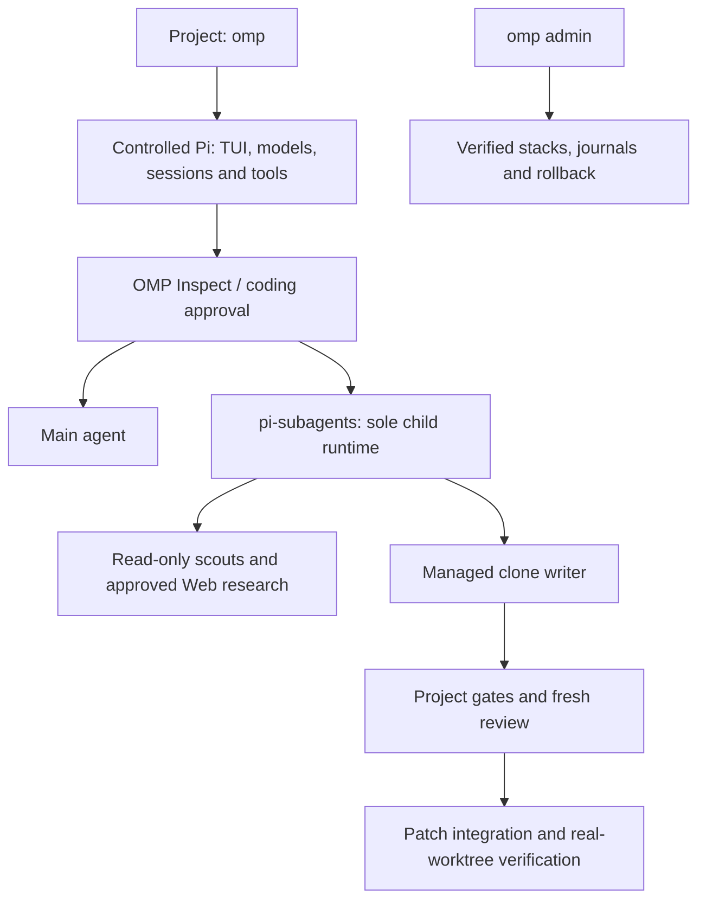

# only-my-pi

English | [简体中文](README.zh-CN.md)

A guarded, user-local terminal coding agent built on [Pi](https://github.com/earendil-works/pi).
Start `omp` in a project, inspect the code, approve project-local coding when needed,
and verify the result before finishing. Pi owns the terminal UI, models, sessions
and tools; `pi-subagents` is the sole physical child-agent runtime.

**Published Preview:** [v0.3.0-preview.1](https://github.com/Ricardo121380/only-my-pi/releases/tag/v0.3.0-preview.1)
— macOS 14+ on native Apple Silicon. Published on September 10, 2026, with immutable
release assets. This is a Preview, with deliberately bounded platform and capability support.

```bash
cd /path/to/project
omp
```

## Contents

- [What you get](#what-you-get)
- [Platform and runtime](#platform-and-runtime)
- [Installation](#installation)
- [Verify release assets](#verify-release-assets)
- [First run and model setup](#first-run-and-model-setup)
- [Daily use and approvals](#daily-use-and-approvals)
- [Managed writers and project verification](#managed-writers-and-project-verification)
- [Configuration and child budgets](#configuration-and-child-budgets)
- [Updates, rollback and removal](#updates-rollback-and-removal)
- [Architecture and repository layout](#architecture-and-repository-layout)
- [Development and validation](#development-and-validation)
- [Release process and evidence](#release-process-and-evidence)
- [Troubleshooting](#troubleshooting)
- [Security, license and references](#security-license-and-references)

## What you get

| Capability | Current behavior |
| --- | --- |
| Direct terminal entry | `omp` starts the controlled Pi TUI without a separate product dashboard. |
| Inspect before coding | Every new interactive process starts in `Inspect`; mutation tools require coding approval. |
| Plans for complex work | Approval includes the scope, risks, plan, subagent strategy and verification. |
| Existing-change preservation | The runtime records the Git baseline and dirty paths; overlapping writer work stays with the main agent. |
| Bounded delegation | Read-only scouts, separately approved Web research, one managed writer and a fresh reviewer use `pi-subagents`. |
| Verified writer integration | Project gates run in the clone; fresh review and patch checks precede integration; real-worktree verification follows. |
| Session continuity | Continue or resume Pi sessions while requesting a new coding grant in each new process. |
| Explicit stack management | Plan-first installation, diagnosis, rollback and removal use ownership records and transaction journals. |
| Verifiable distribution | Full/Thin payloads, hashes, a dependency ledger, SPDX SBOM, notices and GitHub attestations bind the release. |

The direct product does not expose Workflow, Swarm, Goal or Ultra choices in its
normal task flow. Older orchestration interfaces remain advanced compatibility
surfaces. MCP, silent YOLO overrides, background updates, automatic publication
and project-external writer access are outside this Preview's default capability boundary.

## Platform and runtime

| Item | Supported or pinned value |
| --- | --- |
| Managed installation | macOS 14 or newer, native `arm64` Apple Silicon |
| Unsupported managed hosts | Intel Macs, Rosetta, Linux and Windows |
| Embedded Node.js | `24.19.0` |
| Controlled Pi | `0.84.3` |
| Physical subagent runtime | `pi-subagents@0.57.0` |
| Repository development | Node.js `>=22.19.0`; CI pins `22.19.0` and `24.19.0` |
| Model access | Your own provider configuration and authentication through Pi |

The release includes its Node runtime. A system Node or npm installation is not
required for the bootstrap installer. Git is needed for the managed-clone writer.
The installer also requires the macOS tools `curl`, `shasum`, `tar`, `awk` and
`mktemp`. GitHub CLI is optional for installation and useful for signature verification.

The audited external tuple contains nine packages. Being present in this tuple
does not mean every package is enabled in a direct OMP session:

| Package | Version |
| --- | --- |
| `@narumitw/pi-lsp` | `0.49.6` |
| `@narumitw/pi-plan-mode` | `0.55.2` |
| `@sreetej510/pi-usage` | `0.7.1` |
| `pi-agent-extensions` | `0.5.4` |
| `pi-git-sync` | `0.1.3` |
| `pi-memory` | `0.4.1` |
| `pi-permission-modes` | `2.2.0` |
| `pi-subagents` | `0.57.0` |
| `pi-web-access` | `0.25.0` |

The direct launcher uses exact extension filters. Memory, sync, MCP and
experimental overlays are disabled for the direct product; its `/plan` flow is
owned by OMP. See the [external package manifest](contracts/release/external/package.json)
and [direct launcher](packages/direct-agent/launcher.mjs) for the exact selections.

## Installation

### Online bootstrap

Download the installer to a file, verify its pinned checksum, and inspect it before
execution. The checksum below applies specifically to `0.3.0-preview.1`:

```bash
mkdir only-my-pi-preview
cd only-my-pi-preview

curl --fail --location --proto '=https' --proto-redir '=https' --tlsv1.2 \
  https://github.com/Ricardo121380/only-my-pi/releases/download/v0.3.0-preview.1/install.sh \
  --output install.sh

printf '%s  install.sh\n' \
  '542dbcb468221841b460199c41afa9af1d178e8842d7a649b61e00742186e886' \
  | shasum -a 256 -c -

less install.sh
sh install.sh --release 0.3.0-preview.1 --payload thin --plan
```

Review the target paths, package ownership and proposed changes. Then install:

```bash
sh install.sh --release 0.3.0-preview.1 --payload thin
```

The interactive installer asks for confirmation. For an explicitly approved
noninteractive install, add `--yes`. The bootstrap script uses `--yes`; the
management CLI uses `--apply --yes` for mutations.

`--plan` does not commit the managed installation. It still downloads and extracts
verified artifacts into temporary storage. Installation performs its own current
state checks. The installer does not edit shell profiles unless you supply
`--configure-shell`.

If the installer reports `PATH_ACTION_REQUIRED`, follow its printed instructions.
For the current shell, the usual entry is:

```bash
export PATH="$HOME/.local/bin:$PATH"
omp admin version --json
omp admin doctor --json
```

### Full and Thin

| Payload | Download for this release | Dependency acquisition |
| --- | --- | --- |
| Full | About 95.4 MiB | Includes the embedded runtime and complete reviewed dependency payload. |
| Thin | About 1.34 MiB, plus dependencies | Fetches exact public artifacts and verifies their manifest-bound identities. |

Both resolve to the same canonical stack. The online bootstrap accepts
`--payload full`, but still downloads that Full archive from GitHub. For a fully
offline installation, first transfer and verify the local Full archive, then use
its bundled CLI as shown below.

### Local Full bundle, including an offline first install

Complete the [release verification](#verify-release-assets) on a connected machine,
then transfer the verified Full archive and any verification material you need.
The following commands require no system Node and do not fetch the managed dependencies:

```bash
omp_bundle="/absolute/path/only-my-pi-0.3.0-preview.1-darwin-arm64-full.tar.gz"
omp_extract="$(mktemp -d)"
tar -xzf "$omp_bundle" -C "$omp_extract"
omp_payload="$omp_extract/only-my-pi"
mkdir "$omp_payload/omp"
tar -xzf "$omp_payload/only-my-pi.tgz" -C "$omp_payload/omp"

env PATH="$omp_payload/node/bin:$PATH" \
  "$omp_payload/node/bin/node" "$omp_payload/omp/package/bin/omp.mjs" \
  admin stack install --bundle "$omp_bundle" --plan --json
```

After reviewing the plan, use the same verified bundle to apply it:

```bash
env PATH="$omp_payload/node/bin:$PATH" \
  "$omp_payload/node/bin/node" "$omp_payload/omp/package/bin/omp.mjs" \
  admin stack install --bundle "$omp_bundle" --apply --yes --json
```

If OMP is already installed, the equivalent management entry is
`omp admin stack install --bundle "$omp_bundle" --plan --json`, followed by the
explicit apply form. Keep the verified archive for recovery. The extracted
bootstrap directory is temporary; the installed stack has its own managed paths.

### Installed paths and ownership

| Default path | Purpose |
| --- | --- |
| `~/.local/bin/omp`, `~/.local/bin/pi` | User-level command links |
| `~/.local/share/only-my-pi/stacks/` | Verified controlled stacks |
| `~/.local/share/only-my-pi/current-stack` | Active stack pointer |
| `~/.local/share/only-my-pi/lkg-stack` | Previous known-good stack pointer, when available |
| `~/.local/share/only-my-pi/transactions/` | Stack transaction journals |
| `~/.pi/agent/only-my-pi/` | Preferences, generation state and private run artifacts |
| `~/.pi/agent/npm/` | User-owned external Pi package tree |

Homebrew Node/Pi installations are preserved. The user-level `pi` link may take
precedence through `PATH`; it is the controlled/raw Pi entry. Unknown existing
`omp` or `pi` files cause a conflict instead of being overwritten. Existing
third-party packages remain `external/owner=user`; package conflicts require
explicit reconciliation.

## Verify release assets

With a GitHub CLI version that supports release and artifact attestations, download
all ten assets into a fresh directory:

```bash
mkdir only-my-pi-release-assets
cd only-my-pi-release-assets

gh release download v0.3.0-preview.1 --repo Ricardo121380/only-my-pi
gh release verify v0.3.0-preview.1 --repo Ricardo121380/only-my-pi
shasum -a 256 -c SHA256SUMS

for asset in *; do
  gh release verify-asset v0.3.0-preview.1 "$asset" \
    --repo Ricardo121380/only-my-pi
done
```

`SHA256SUMS` covers eight files. It excludes itself and `release-index.json`;
release attestations cover the complete asset set. To verify the Full payload's
build source as well:

```bash
gh attestation verify only-my-pi-0.3.0-preview.1-darwin-arm64-full.tar.gz \
  --repo Ricardo121380/only-my-pi \
  --source-digest aaf22c968c9defeb9106680a30504e4ca6949052 \
  --signer-digest aaf22c968c9defeb9106680a30504e4ca6949052 \
  --source-ref refs/heads/main \
  --signer-workflow Ricardo121380/only-my-pi/.github/workflows/m11-publish.yml \
  --deny-self-hosted-runners
```

The same source check applies to Thin. Adding
`--predicate-type https://spdx.dev/Document/v2.3` selects the SPDX attestation.
The published Full archive has SHA-256:

```text
9990fb9dd81b5ecaab9b31d5344fb8aab3715fd89b61f07ed5fefc7191d60b0d
```

## First run and model setup

1. Install and run `omp admin doctor --json`.
2. If Pi has no usable authenticated model, start the controlled `pi` command and
   complete its normal provider setup. `/login` handles supported login flows;
   API-key or custom-provider configuration follows Pi's provider documentation.
3. Return to your project and start `omp`. Honor Pi Project Trust and choose a
   model in the authenticated model picker, or pass `--model provider/model-id`.
4. Start with an inspection task, then approve coding when you are ready to change files.

OMP does not supply a model subscription or provider credits. Credentials remain
in Pi's credential mechanism or your secret manager; do not put them into OMP
preferences, project JSON or this repository. The recent-model preference stores
only a provider/model identifier. Cancelling model selection exits cleanly.

`pi` is the advanced/raw runtime entry and can discover a different extension set.
Use `omp` for the guarded product flow. In the current direct runtime, delegated
scouts, writers and reviewers inherit the active parent model and thinking level.

## Daily use and approvals

```bash
omp                              # interactive agent
omp "fix the failing login test"  # initial task
omp -c                           # continue the latest Pi session
omp -r                           # select a session to resume
omp --model provider/model-id     # explicit model selection
omp -p "review the error handling" --model provider/model-id
omp -- "status"                  # treat a management word as a task
```

Headless `-p`/`--print` mode is read-only: it exposes read/search tools, not a coding
grant, Bash, a managed writer or interactive Web approval. It needs an explicit
model unless a usable recent model is available.

| TUI command or key | Purpose |
| --- | --- |
| `/plan <task>` | Require the planning flow before coding. |
| `/access` | Show the current coding-access state. |
| `/access revoke` | Return immediately to `Inspect`. |
| `/agents` | Show current child work and cumulative child-budget usage. |
| `/model` | Use Pi's model selection. |
| `Esc` | Interrupt current work and propagate cancellation. |
| `/exit` | Exit through Pi's native shutdown path. |
| `Ctrl+D` | Exit when the input editor is empty. |

A coding grant lasts for one interactive OMP process. Further work within that
grant can reuse it; `omp -c` and `omp -r` restore conversation history, not coding
authority. A new process starts in `Inspect` and asks again. Public Web research
requires a separate approval for that research task, even when coding is enabled.

Approval does not authorize project-external writes, secret access, destructive
Git operations, deployment or publication. OMP does not silently stage, commit or
push changes. `/omp run` is retired in direct sessions: enter your task directly.
Historical controls are available under `/omp advanced ...` for expert use.

## Managed writers and project verification

Simple changes stay with the main agent. Complex work can use read-only scouts,
one managed-clone writer and a fresh reviewer. The runtime permits at most two
concurrent children, eight total children and one managed writer per process,
subject to any lower configured budget.

A managed writer starts from the approved Git HEAD in an ordinary clone. It does
not receive uncommitted user content. If the requested scope overlaps dirty paths,
OMP returns `MAIN_AGENT_FALLBACK_DIRTY_OVERLAP` and keeps implementation in the
original worktree with the main agent.

For automatic writer integration, the trusted project and clone must contain the
same `.pi/only-my-pi-gates.json` at the approved HEAD. Commit that manifest to the
project before delegating a writer. For a Node project with an `npm test` script:

```json
{
  "$schema": "https://raw.githubusercontent.com/Ricardo121380/only-my-pi/main/schemas/project-gates-v1.schema.json",
  "formatVersion": 1,
  "id": "project-checks",
  "gates": [
    {
      "id": "unit-tests",
      "description": "Run the project's unit tests",
      "command": "npm",
      "args": ["test"],
      "cwd": ".",
      "timeoutSeconds": 900,
      "env": { "CI": "1" }
    }
  ]
}
```

Replace the example with commands appropriate to your project. The runtime shows
the resolved executable, arguments, working directory, environment and timeout
for confirmation; it does not execute a model's free-form verification text.

The integration sequence is:

1. Capture the writer's bounded patch and check its reported paths.
2. Confirm and execute the configured project gates in the clone.
3. Require a fresh reviewer to pass.
4. Recheck the base, scope, patch digest and current worktree; check application before applying.
5. Integrate the patch and have the main agent verify it again in the real worktree.

Missing or changed manifests, failed tests, review findings, patch drift and
conflicts block integration and retain the patch for review. A clone is not an OS
sandbox. Project gates are an explicit process allowlist, run with a scrubbed
environment; they do not provide filesystem or network isolation by themselves.

## Configuration and child budgets

Default global preferences live at `~/.pi/agent/only-my-pi/preferences.json`.
A trusted project can supply `.pi/only-my-pi.json`. Project configuration can
narrow capabilities and budgets, not expand the active generation's authority.
For example, reduce this project's child budget:

```json
{
  "$schema": "https://raw.githubusercontent.com/Ricardo121380/only-my-pi/main/schemas/preferences-v1.schema.json",
  "formatVersion": 1,
  "budgets": {
    "daily": {
      "maxConcurrency": 2,
      "maxChildren": 4,
      "maxDepth": 1,
      "maxTotalTokens": 20000,
      "maxWallSeconds": 900
    }
  }
}
```

Restart OMP after changing execution-related preferences. Defaults for delegated
work in one direct process are:

| Limit | Default |
| --- | --- |
| Concurrent children / total children | `2` / `8` |
| Delegation depth | `1`; `0` disables children |
| Cumulative reported child tokens | `50,000` |
| Cumulative reported child cost | `$0.25` |
| Shared child wall-time window | `1,800` seconds, starting with the first admission |
| Turns / tool calls per child | `8` / `16`; role-specific lower ceilings also apply |
| Total child tool calls | `64` |
| Returned result bytes per child / total | `65,536` / `262,144` |

The effective limits take the minimum of applicable budgets. These are child
limits; main-agent usage is separate. Completed and failed child usage remains
charged to the process. Exhaustion, invalid usage or an unproven cancellation
stops further delegation and writer integration. Reported usage can arrive late,
so these controls are not exact provider billing caps. Byte limits cover returned
results, not all private logs. See [the preference schema](schemas/preferences-v1.schema.json)
and [configuration implementation](packages/daily-config/index.mjs).

## Updates, rollback and removal

Inspect the installation and check the current Preview series explicitly:

```bash
omp admin version --json
omp admin status --json
omp admin doctor --json
omp admin stack status --json
omp admin release check --channel preview --json
```

There is no background updater. Release discovery reports newer versions in the
same Preview series, but the current bootstrap/release resolver accepts its own
exact version. Use a future release's verified installer for that release; do not
substitute an invented version or a `latest` URL into this installer.

To apply a verified local bundle whose version is supported by the installed management CLI:

```bash
omp admin stack update --bundle /absolute/path/reviewed-full.tar.gz --plan --json
omp admin stack update --bundle /absolute/path/reviewed-full.tar.gz --apply --yes --json
```

Rollback to an available known-good stack, or remove the managed stack:

```bash
omp admin stack rollback --plan --json
omp admin stack rollback --apply --yes --json

omp admin stack remove --plan --json
omp admin stack remove --apply --yes --json
```

Review each plan independently. `--to sha256:<stack-id>` selects an exact rollback
target. Active controlled Pi processes require separate `--terminate-pi` authority;
the process handler uses bounded `SIGTERM`, not `SIGKILL`.

`omp admin uninstall` removes OMP activation and its entry; full stack removal is
an explicitly separate operation. Removal reconciles ownership records, preserves
preexisting or changed user data, and may retain material for manual review.
Provider credentials, sessions and system Homebrew installations are not an
uninstall target. Do not manually delete transaction journals or retarget stack links.

## Architecture and repository layout



| Path | Responsibility |
| --- | --- |
| `bin/` | CLI entry and management routing |
| `extensions/omp-direct/` | Direct session state, model selection, coding grants and tool boundaries |
| `extensions/omp-control/` | OMP control integration and advanced compatibility commands |
| `extensions/context-doctor/`, `extensions/session-ledger/` | Context/status observations and session records |
| `packages/direct-agent/` | Launcher, workspace baseline, clone writer, delegation and verification |
| `packages/release-stack/`, `packages/bootstrap/` | Payload verification, ownership, installation and recovery |
| `packages/daily-config/`, `packages/project-gates/`, `packages/web-policy/` | Preferences, executable verification and approved Web boundaries |
| `packages/subagents/` | Historical governed orchestration kernel and the shared backend adapter |
| `agents/`, `bundles/` | Agent definitions and generated `pi-subagents` resources |
| `profiles/`, `presets/`, `overlays/`, `policies/` | Versioned resource and capability contracts |
| `skills/`, `prompts/`, `themes/` | Package resources used by Pi |
| `contracts/`, `schemas/`, `inventory/` | Machine-readable contracts, validation and pinned dependency inventory |
| `distribution/`, `.github/workflows/` | Bootstrap script and CI/release automation |
| `scripts/`, `tests/`, `verification/` | Checks, regression tests and source-bound evidence |
| `docs/`, `codex/` | Design/history and repository-development instructions; not Pi prompt resources |

The historical S0–S5 orchestration kernel, M8 daily harness and M9/M10 migration
work support the direct product. The earlier `0.2.0-preview.1` distribution
remains `HOLD_PUBLICATION` as `INTERNAL_DISTRIBUTION_FOUNDATION`; it is not a
published installer target. M12 introduced direct terminal coding, and M13 added
runtime writer verification and cumulative child-budget enforcement. Historical
receipts describe their own source commits, not the current release.

## Development and validation

```bash
git clone https://github.com/Ricardo121380/only-my-pi.git
cd only-my-pi
npm ci --ignore-scripts --no-audit --no-fund

npm run lint
npm run typecheck
npm run schema:check
npm run pack:check
node --test tests/ci-contract.test.mjs tests/docs-links.test.mjs
npm run verify:m12
```

A source checkout does not replace the installed controlled stack. For integration
work, use disposable projects/configuration roots and the repository's fixture
helpers. Do not point install or live-model tests at your real Pi home implicitly.

| Check | Meaning |
| --- | --- |
| `npm run doctor`, `npm run doctor:profiles` | Validate static package resources and profiles. |
| `npm run profile:check`, `npm run agents:check` | Check configuration and generated agent resources. |
| `npm run pack:check` | Verify the package's positive content allowlist. |
| `npm test` | Run the repository test suite. |
| `npm run verify` | Inspect the versioned release-gate contract. |
| `npm run verify -- --run` | Execute that release-gate contract on a clean source commit. |
| `npm run verify:m12` | Inspect the C1–C12 direct-agent contract. |
| `npm run verify:m12:run` | Execute C1–C10; protected C11/C12 require separately captured evidence. |

Use targeted checks while editing and the required gate sets before promotion.
Without protected evidence, `NOT_RUN_BY_POLICY` is expected for live gates; it
is not a live-model PASS. Never overwrite old receipts, reuse evidence against a
new source, or rerun historical development goals to manufacture current evidence.

## Release process and evidence

The published `0.3.0-preview.1` binds:

- Source **S**: [`aaf22c968c9defeb9106680a30504e4ca6949052`](https://github.com/Ricardo121380/only-my-pi/commit/aaf22c968c9defeb9106680a30504e4ca6949052).
- Protected evidence **E**: [`c4af7fd0dbe748b9b5cbab0db222935116dcc12d`](https://github.com/Ricardo121380/only-my-pi/commit/c4af7fd0dbe748b9b5cbab0db222935116dcc12d), a direct evidence-only child of S.
- **26 protected assertions**: eight installation/rollback assertions and eighteen direct coding/runtime assertions.
- **10 release assets**, with ten build-provenance and two SPDX attestation checks.
- **Seven identical RC/Final core assets**: Full, Thin, installer, SBOM, notices, stack manifest and artifact ledger.

The release assets are:

| File | Purpose |
| --- | --- |
| `install.sh` | Exact-version bootstrap installer |
| `only-my-pi-0.3.0-preview.1-darwin-arm64-full.tar.gz` | Complete local payload |
| `only-my-pi-0.3.0-preview.1-darwin-arm64-thin.tar.gz` | Payload with verified dependency acquisition |
| `release-index.json` | Version, source and asset identities |
| `stack-manifest.json` | Controlled stack identity and composition |
| `transitive-artifact-ledger.json` | Dependency artifact integrity ledger |
| `SHA256SUMS` | Eight content checksums |
| `only-my-pi-0.3.0-preview.1.spdx.json` | SPDX software bill of materials |
| `THIRD_PARTY_NOTICES.txt` | Distributed third-party notices |
| `only-my-pi-0.3.0-preview.1-protected-receipt.json` | Source-bound C11/C12 evidence |

[CI](.github/workflows/ci.yml) checks Node `22.19.0`, Node `24.19.0` and a macOS arm64
clean-home Q10 installation. The [RC workflow](.github/workflows/m11-rc.yml) builds
and attests a source-bound candidate without publication authority. The
[publication workflow](.github/workflows/m11-publish.yml) verifies the S/E relationship,
compares RC/Final bytes, creates a Draft and waits for `public-preview` approval.
Its recovery mode verifies an existing attested Draft without rebuilding it.
The publish job supplies `GH_REPO` because it runs without a source checkout.

Repository immutability settings require an administrative preflight; the
workflow requires that confirmation plus environment approval, then verifies the
published immutable release and its assets. The first release's final publication
was completed with an explicit repository argument after approval; the workflow
context correction is maintained on `main`. Do not treat that original Actions
run as an entirely successful automatic publication.

The immutable tag and asset signatures identify released bytes. New README or
workflow commits on `main` do not modify those bytes. Do not rerun publication to
replace this version; a later release needs its own version, source, evidence and
reviewed release process. See the [release notes](docs/releases/0.3.0-preview.1.md).

## Troubleshooting

| Symptom | Next action |
| --- | --- |
| `PATH_ACTION_REQUIRED` | Add the printed user-bin path to the intended shell; installation may already be complete. |
| `SHIM_CONFLICT` | Inspect the existing `omp`/`pi` file; do not overwrite an unknown command. |
| `OMP_CONTROLLED_STACK_UNAVAILABLE` / `M12_UPDATE_REQUIRED` | Inspect `omp admin version` and `doctor`; install the reviewed current bundle rather than manually changing links. |
| `MODEL_AUTH_UNAVAILABLE` / `HEADLESS_MODEL_REQUIRED` | Configure the provider through Pi, then choose a usable model explicitly. |
| `CODING_ACCESS_REQUIRED` / `COMPLEX_PLAN_REQUIRED` | Inspect first and approve the required coding plan for this process. |
| `UNSUPPORTED_UNSAFE_OVERRIDE` | Return to the supported Build permission mode and request coding access again. |
| `MAIN_AGENT_FALLBACK_DIRTY_OVERLAP` | Keep the existing changes; let the main agent handle the overlapping scope. |
| `WRITER_GATE_MANIFEST_REQUIRED` / `WRITER_GATE_MANIFEST_DRIFT` | Check the trusted gate manifest and its presence at the approved Git HEAD. |
| `WRITER_REVIEW_BLOCKED` / failed clone verification | Review the retained patch and actual findings; do not bypass integration checks. |
| `DIRECT_CHILD_BUDGET_EXHAUSTED` | Review `/agents`; the process cannot admit further children or integrate a writer after budget exhaustion. |
| Package, checksum or tree-identity conflict | Preserve the error code and identities; reconcile the exact reviewed package set before retrying. |
| `MANUAL_RECONCILIATION_REQUIRED` | Preserve journals and backups and follow the reported reconciliation plan. |

For a report, include the exact version, platform, redacted error code and a small
reproduction. Do not attach credentials, raw sessions or private repository contents.

## Security, license and references

Pi extensions and packages run with the invoking user's OS authority. Project
Trust, approval prompts and managed clones are not whole-session isolation.
Bash sandboxing is surface-specific; inspect the actual active/degraded state.
Use an appropriate outer boundary for code or extensions you do not trust.

Never commit API keys, OAuth tokens, cookies, credential stores, sessions, memory
databases, caches, private run archives or unrelated private source. Report suspected
vulnerabilities through the repository's [private security reporting](https://github.com/Ricardo121380/only-my-pi/security/advisories/new), not a public issue.

First-party code is under the [MIT license](LICENSE). Dependencies retain their own
licenses; consult [third-party notices](THIRD_PARTY_NOTICES.md), the released notices
and SPDX SBOM. No provider credentials or paid model access are distributed.

Useful references:

- [Direct terminal agent decision](docs/decisions/ADR-0013-direct-terminal-coding-agent.md)
- [Distribution and history/privacy decision](docs/decisions/ADR-0012-public-preview-distribution-and-history-privacy.md)
- [Preference and budget design](docs/decisions/ADR-0010-overlay-model-and-budget-configuration.md)
- [Documentation index](docs/README.md), [dated milestone history](docs/STATUS.md) and [Labs boundaries](docs/LABS.md)
- [Security policy](SECURITY.md) and [threat model](docs/threat-model.md)
- [Report a non-sensitive bug](https://github.com/Ricardo121380/only-my-pi/issues)

Some design and historical documents describe earlier milestones and example
versions. Use this README and the exact published release assets for current
installation instructions; use dated records to understand their original scope.
