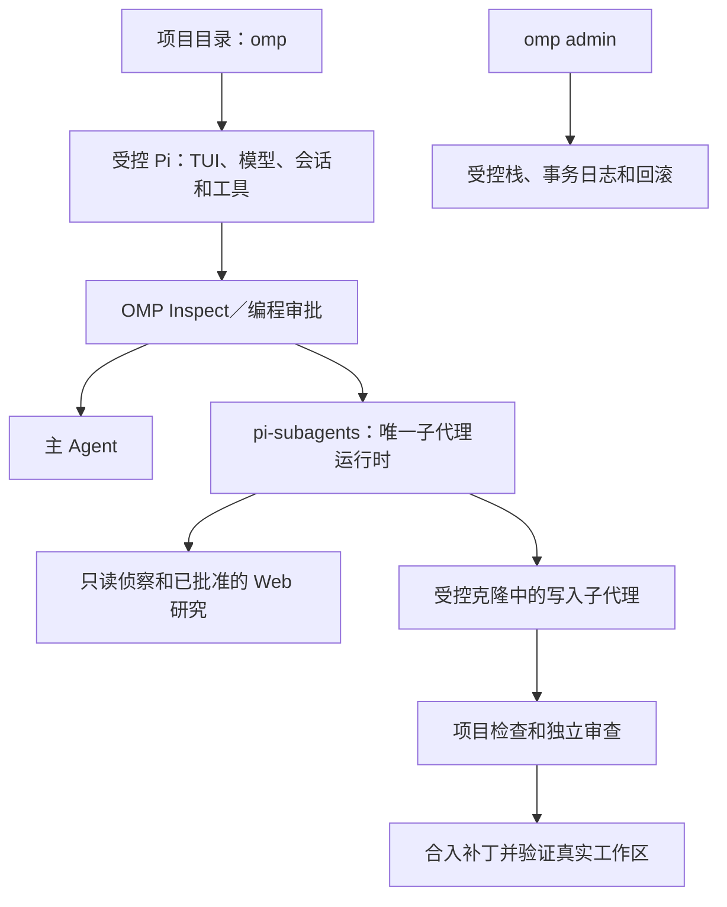

# only-my-pi

[English](README.md) | 简体中文

基于 [Pi](https://github.com/earendil-works/pi) 的受约束、按用户安装的终端编程 Agent。
在项目目录运行 `omp`，先阅读和检查代码，需要修改时批准项目内的编程计划，完成后验证结果。
Pi 负责终端界面、模型、会话和工具；`pi-subagents` 是唯一实际创建子 Agent 进程的运行时。

**已发布的 Preview：** [v0.3.0-preview.1](https://github.com/Ricardo121380/only-my-pi/releases/tag/v0.3.0-preview.1)
—— 支持 macOS 14+、原生 Apple Silicon。该版本于 2026 年 9 月 10 日发布，发布资产已锁定为不可变。
当前仍为 Preview，平台与能力范围有明确限制。

```bash
cd /path/to/project
omp
```

## 目录

- [项目能力](#项目能力)
- [平台与运行时](#平台与运行时)
- [安装](#安装)
- [验证发布资产](#验证发布资产)
- [首次启动与模型配置](#首次启动与模型配置)
- [日常使用与审批](#日常使用与审批)
- [写入子代理与项目验证](#写入子代理与项目验证)
- [配置与子代理预算](#配置与子代理预算)
- [更新回滚与移除](#更新回滚与移除)
- [架构与目录结构](#架构与目录结构)
- [开发与验证](#开发与验证)
- [发布流程与证据](#发布流程与证据)
- [常见问题](#常见问题)
- [安全许可证与参考资料](#安全许可证与参考资料)

## 项目能力

| 能力 | 当前行为 |
| --- | --- |
| 直接进入终端 | `omp` 启动受控 Pi TUI，无需进入单独的产品控制台。 |
| 先检查再修改 | 每个新的交互进程都从 `Inspect` 开始，修改工具需要编程审批。 |
| 复杂任务先计划 | 审批内容包含范围、风险、计划、子代理策略和验证方式。 |
| 保留已有改动 | 记录 Git 基线和未提交路径；与已有改动重叠的写入任务交给主 Agent。 |
| 有预算的任务委派 | 只读侦察、单独授权的 Web 研究、一个写入子代理和独立审查者均使用 `pi-subagents`。 |
| 验证后合入 | 先在克隆中执行项目检查，通过独立审查与补丁检查后合入，再验证真实工作区。 |
| 延续会话 | 可以继续或恢复 Pi 会话；每次新进程都需要重新取得编程授权。 |
| 显式管理安装 | 安装、诊断、回滚和移除先生成计划，并依据所有权记录和事务日志执行。 |
| 可验证分发 | Full／Thin 包、哈希、依赖清单、SPDX SBOM、许可证声明和 GitHub 签名共同绑定发布内容。 |

日常任务流程不要求用户选择 Workflow、Swarm、Goal 或 Ultra。旧编排接口保留为高级兼容入口。
MCP、静默 YOLO 覆盖、后台更新、自动发布和项目外写入子代理不在当前 Preview 的默认能力范围内。

## 平台与运行时

| 项目 | 支持范围或固定版本 |
| --- | --- |
| 受控安装 | macOS 14 及以上、原生 `arm64` Apple Silicon |
| 不支持的受控安装环境 | Intel Mac、Rosetta、Linux、Windows |
| 内嵌 Node.js | `24.19.0` |
| 受控 Pi | `0.84.3` |
| 子代理物理运行时 | `pi-subagents@0.57.0` |
| 仓库开发环境 | Node.js `>=22.19.0`；CI 固定检查 `22.19.0` 和 `24.19.0` |
| 模型访问 | 使用你通过 Pi 配置的服务商和认证信息 |

发布包自带 Node 运行时，使用引导安装器不需要预先安装系统 Node 或 npm。
写入子代理需要 Git。安装器还使用 macOS 的 `curl`、`shasum`、`tar`、`awk` 和 `mktemp`。
GitHub CLI 不是安装必需项，但可以用于验证发布证明和资产来源签名。

审核过的外部依赖组合包含以下九个包。包被纳入组合，不代表它的全部能力都会在直接 OMP 会话中启用：

| 包 | 版本 |
| --- | --- |
| `@narumitw/pi-lsp` | `0.49.6` |
| `@narumitw/pi-plan-mode` | `0.55.2` |
| `@sreetej510/pi-usage` | `0.7.1` |
| `pi-agent-extensions` | `0.5.4` |
| `pi-git-sync` | `0.1.3` |
| `pi-memory` | `0.4.1` |
| `pi-permission-modes` | `2.2.0` |
| `pi-subagents` | `0.57.0` |
| `pi-web-access` | `0.25.0` |

直接启动器按精确列表筛选扩展。直接产品禁用 memory、sync、MCP 和 experimental overlay，
其 `/plan` 流程由 OMP 负责。完整选择可查看[外部依赖清单](contracts/release/external/package.json)
和[直接启动器](packages/direct-agent/launcher.mjs)。

## 安装

### 在线引导安装

先下载安装器文件，验证固定哈希并阅读脚本，再执行。下面的哈希只适用于 `0.3.0-preview.1`：

```bash
mkdir only-my-pi-preview
cd only-my-pi-preview

curl --fail --location --proto '=https' --proto-redir '=https' --tlsv1.2 \
  https://github.com/Ricardo121380/only-my-pi/releases/download/v0.3.0-preview.1/install.sh \
  --output install.sh

printf '%s  install.sh\n' \
  '542dbcb468221841b460199c41afa9af1d178e8842d7a649b61e00742186e886' \
  | shasum -a 256 -c -

less install.sh
sh install.sh --release 0.3.0-preview.1 --payload thin --plan
```

核对目标目录、包所有权和拟执行的改动后，再安装：

```bash
sh install.sh --release 0.3.0-preview.1 --payload thin
```

交互安装器会请求确认。已经明确批准的非交互安装可以添加 `--yes`。
注意区分两种入口：引导脚本使用 `--yes`；管理 CLI 的修改操作使用 `--apply --yes`。

`--plan` 不提交受控安装状态，但仍会下载并解压经过验证的资产到临时目录。
正式安装时还会重新检查当前状态。只有显式添加 `--configure-shell`，安装器才会修改 shell 配置。

如果出现 `PATH_ACTION_REQUIRED`，按安装器打印的指引操作。当前 shell 通常可以使用：

```bash
export PATH="$HOME/.local/bin:$PATH"
omp admin version --json
omp admin doctor --json
```

### Full 与 Thin 的区别

| 包类型 | 本版本下载大小 | 依赖获取方式 |
| --- | --- | --- |
| Full | 约 95.4 MiB | 包含内嵌运行时和完整的已审核依赖载荷。 |
| Thin | 约 1.34 MiB，另需下载依赖 | 获取精确的公开资产，并按 manifest 绑定的身份进行验证。 |

两者最终解析为同一个规范栈。在线引导脚本支持 `--payload full`，但仍会从 GitHub 下载 Full 包。
完全离线安装需要提前传输并验证本地 Full 包，再使用下面的包内 CLI。

### 使用本地 Full 包，包括首次离线安装

先在联网设备完成[发布资产验证](#验证发布资产)，再传输已验证的 Full 包及所需验证材料。
下面的命令不依赖系统 Node，也不会下载受控安装所需的依赖：

```bash
omp_bundle="/absolute/path/only-my-pi-0.3.0-preview.1-darwin-arm64-full.tar.gz"
omp_extract="$(mktemp -d)"
tar -xzf "$omp_bundle" -C "$omp_extract"
omp_payload="$omp_extract/only-my-pi"
mkdir "$omp_payload/omp"
tar -xzf "$omp_payload/only-my-pi.tgz" -C "$omp_payload/omp"

env PATH="$omp_payload/node/bin:$PATH" \
  "$omp_payload/node/bin/node" "$omp_payload/omp/package/bin/omp.mjs" \
  admin stack install --bundle "$omp_bundle" --plan --json
```

核对计划后，用同一个经过验证的包执行安装：

```bash
env PATH="$omp_payload/node/bin:$PATH" \
  "$omp_payload/node/bin/node" "$omp_payload/omp/package/bin/omp.mjs" \
  admin stack install --bundle "$omp_bundle" --apply --yes --json
```

如果已经安装 OMP，也可以使用
`omp admin stack install --bundle "$omp_bundle" --plan --json`，再执行显式 apply 命令。
建议保留验证过的压缩包用于恢复。解压出来的引导目录是临时目录，正式安装后的栈使用独立受控路径。

### 安装路径与所有权

| 默认路径 | 用途 |
| --- | --- |
| `~/.local/bin/omp`、`~/.local/bin/pi` | 用户级命令链接 |
| `~/.local/share/only-my-pi/stacks/` | 经过验证的受控栈 |
| `~/.local/share/only-my-pi/current-stack` | 当前栈指针 |
| `~/.local/share/only-my-pi/lkg-stack` | 可用时指向上一个已知良好栈 |
| `~/.local/share/only-my-pi/transactions/` | 栈事务日志 |
| `~/.pi/agent/only-my-pi/` | 偏好、generation 状态及私有运行产物 |
| `~/.pi/agent/npm/` | 用户拥有的外部 Pi 包目录 |

已有 Homebrew Node／Pi 安装会保留。用户级 `pi` 链接可能通过 `PATH` 优先被找到，
它是受控栈的原始 Pi 入口。未知的现有 `omp` 或 `pi` 文件会触发冲突，不会被直接覆盖。
已有第三方包继续标记为 `external/owner=user`；包冲突需要显式核对和处理。

## 验证发布资产

使用支持发布证明和资产来源签名的 GitHub CLI，将全部十个资产下载到一个新目录：

```bash
mkdir only-my-pi-release-assets
cd only-my-pi-release-assets

gh release download v0.3.0-preview.1 --repo Ricardo121380/only-my-pi
gh release verify v0.3.0-preview.1 --repo Ricardo121380/only-my-pi
shasum -a 256 -c SHA256SUMS

for asset in *; do
  gh release verify-asset v0.3.0-preview.1 "$asset" \
    --repo Ricardo121380/only-my-pi
done
```

`SHA256SUMS` 覆盖八个文件，不包括自身和 `release-index.json`；发布证明覆盖完整资产集合。
还可以验证 Full 包的构建源码身份：

```bash
gh attestation verify only-my-pi-0.3.0-preview.1-darwin-arm64-full.tar.gz \
  --repo Ricardo121380/only-my-pi \
  --source-digest aaf22c968c9defeb9106680a30504e4ca6949052 \
  --signer-digest aaf22c968c9defeb9106680a30504e4ca6949052 \
  --source-ref refs/heads/main \
  --signer-workflow Ricardo121380/only-my-pi/.github/workflows/m11-publish.yml \
  --deny-self-hosted-runners
```

Thin 包使用相同的源码检查。添加
`--predicate-type https://spdx.dev/Document/v2.3` 可以选择 SPDX 签名。
本次发布的 Full 包 SHA-256 为：

```text
9990fb9dd81b5ecaab9b31d5344fb8aab3715fd89b61f07ed5fefc7191d60b0d
```

## 首次启动与模型配置

1. 完成安装，运行 `omp admin doctor --json`。
2. 如果 Pi 还没有可用且已认证的模型，启动受控 `pi`，完成其正常服务商配置。
   `/login` 用于支持的登录流程；API key 或自定义服务商按 Pi 的对应文档配置。
3. 回到项目目录启动 `omp`，按 Pi Project Trust 流程确认项目，并在已认证模型列表中选择模型。
   也可以通过 `--model provider/model-id` 显式指定。
4. 先进行阅读或检查任务，准备修改文件时再批准编程请求。

OMP 不提供模型订阅或服务商额度。凭据保留在 Pi 的认证机制或你的密钥管理器中，
不要写入 OMP 偏好、项目 JSON 或本仓库。最近使用模型的偏好只保存服务商／模型标识。
取消模型选择会正常退出。

`pi` 是高级原始运行时入口，可能发现与受约束 OMP 会话不同的扩展集合。
日常使用本产品请运行 `omp`。当前直接运行时中的侦察、写入和审查子代理继承主 Agent
正在使用的模型及 thinking 级别。

## 日常使用与审批

```bash
omp                              # 交互 Agent
omp "fix the failing login test"  # 带初始任务启动
omp -c                           # 继续最近的 Pi 会话
omp -r                           # 选择要恢复的会话
omp --model provider/model-id     # 显式选择模型
omp -p "review the error handling" --model provider/model-id
omp -- "status"                  # 将管理命令同名词当作普通任务
```

无界面的 `-p`／`--print` 模式只读，只提供阅读和搜索工具，不提供编程授权、Bash、
写入子代理或交互式 Web 审批。如果没有可用的最近模型，需要显式指定模型。

| TUI 命令或按键 | 用途 |
| --- | --- |
| `/plan <task>` | 要求先进入计划流程，再开始编程。 |
| `/access` | 查看当前编程授权状态。 |
| `/access revoke` | 立即返回 `Inspect`。 |
| `/agents` | 查看子代理任务及累计预算用量。 |
| `/model` | 使用 Pi 的模型选择。 |
| `Esc` | 中断当前工作，并向子任务传递取消。 |
| `/exit` | 通过 Pi 原生关闭流程退出。 |
| `Ctrl+D` | 输入框为空时退出。 |

编程授权只在一个交互式 OMP 进程中有效，授权范围内的后续工作可以复用。
`omp -c` 和 `omp -r` 恢复的是对话历史，不是编程权限。新进程从 `Inspect` 开始，
需要重新审批。即使已经允许编程，公开 Web 研究仍需针对该研究任务单独审批。

编程审批不包含项目外写入、秘密读取、破坏性 Git 操作、部署或发布。
OMP 不会静默暂存、提交或推送改动。直接会话中的 `/omp run` 已退役，直接输入任务即可。
历史控制接口保留在 `/omp advanced ...` 下，供熟悉这些接口的用户使用。

## 写入子代理与项目验证

简单修改由主 Agent 完成。复杂任务可以使用只读侦察、一个受控克隆中的写入子代理，
以及一个独立审查者。每个进程最多两个并发子代理、累计八个子代理、一个受控写入子代理；
如果配置了更低预算，则按更低值执行。

写入子代理从已批准的 Git HEAD 创建普通克隆，不会收到用户未提交的内容。
如果请求范围与已有改动重叠，OMP 返回 `MAIN_AGENT_FALLBACK_DIRTY_OVERLAP`，
由主 Agent 留在原工作区处理。

要自动合入写入补丁，已信任的项目和克隆必须在已批准 HEAD 上包含相同的
`.pi/only-my-pi-gates.json`。委派写入任务前，先把该清单提交到项目。
下面是具有 `npm test` 脚本的 Node 项目示例：

```json
{
  "$schema": "https://raw.githubusercontent.com/Ricardo121380/only-my-pi/main/schemas/project-gates-v1.schema.json",
  "formatVersion": 1,
  "id": "project-checks",
  "gates": [
    {
      "id": "unit-tests",
      "description": "Run the project's unit tests",
      "command": "npm",
      "args": ["test"],
      "cwd": ".",
      "timeoutSeconds": 900,
      "env": { "CI": "1" }
    }
  ]
}
```

请将示例换成适合你的项目的检查命令。运行时会展示实际解析的可执行文件、参数、工作目录、
环境和超时时间供确认；不会直接执行模型自由描述的“验证命令”。

合入流程为：

1. 提取写入子代理的受限补丁，核对其报告的修改路径。
2. 确认并在克隆中执行项目清单里的检查。
3. 要求一个全新上下文的审查者给出通过结论。
4. 重新核对基线、范围、补丁哈希和当前工作区，先检查补丁是否可应用。
5. 合入补丁，再由主 Agent 在真实工作区执行验证。

清单缺失或变化、测试失败、审查发现问题、补丁漂移和冲突都会阻止合入，并保留补丁供审阅。
克隆不是操作系统沙箱。项目检查是显式的进程执行允许列表，使用经过清理的环境运行，
本身不提供文件系统或网络隔离。

## 配置与子代理预算

默认全局偏好位于 `~/.pi/agent/only-my-pi/preferences.json`。
已信任的项目可以提供 `.pi/only-my-pi.json`。项目配置只能收紧能力和预算，
不能扩大当前 generation 的权限。例如，可以降低该项目的子代理预算：

```json
{
  "$schema": "https://raw.githubusercontent.com/Ricardo121380/only-my-pi/main/schemas/preferences-v1.schema.json",
  "formatVersion": 1,
  "budgets": {
    "daily": {
      "maxConcurrency": 2,
      "maxChildren": 4,
      "maxDepth": 1,
      "maxTotalTokens": 20000,
      "maxWallSeconds": 900
    }
  }
}
```

修改与执行相关的偏好后，重启 OMP。单个直接进程中，委派工作的默认预算为：

| 限制 | 默认值 |
| --- | --- |
| 并发子代理／累计子代理 | `2`／`8` |
| 委派深度 | `1`；设为 `0` 禁用子代理 |
| 累计上报的子代理 tokens | `50,000` |
| 累计上报的子代理费用 | `$0.25` |
| 子代理共享时间窗口 | `1,800` 秒，从第一个子代理获准启动时开始 |
| 每个子代理的轮次／工具调用 | `8`／`16`；具体角色还可能有更低上限 |
| 累计子代理工具调用 | `64` |
| 单个／累计返回结果字节数 | `65,536`／`262,144` |

最终限制取适用预算中的最小值。这些限制针对子代理，主 Agent 用量另计。
已完成和失败的子代理用量仍计入当前进程。预算耗尽、无效用量或无法证明结束的取消，
都会阻止继续委派和合入写入补丁。用量上报可能延迟，因此这些控制不是服务商账单的精确硬上限。
字节限制针对返回结果，不覆盖所有私有日志。详见[偏好 schema](schemas/preferences-v1.schema.json)
和[配置实现](packages/daily-config/index.mjs)。

## 更新回滚与移除

显式查看安装情况，并检查当前 Preview 系列：

```bash
omp admin version --json
omp admin status --json
omp admin doctor --json
omp admin stack status --json
omp admin release check --channel preview --json
```

项目没有后台更新器。发布发现可以报告同一 Preview 系列的新版本，但当前引导脚本和发布解析器
只接受其自身绑定的精确版本。安装未来版本时，应使用该版本经过验证的安装器；
不要给旧安装器替换一个猜测的版本号或 `latest` 地址。

对于已安装管理 CLI 支持的版本，可以应用经过验证的本地包：

```bash
omp admin stack update --bundle /absolute/path/reviewed-full.tar.gz --plan --json
omp admin stack update --bundle /absolute/path/reviewed-full.tar.gz --apply --yes --json
```

回滚到可用的已知良好栈，或移除受控栈：

```bash
omp admin stack rollback --plan --json
omp admin stack rollback --apply --yes --json

omp admin stack remove --plan --json
omp admin stack remove --apply --yes --json
```

分别核对每项操作的计划。`--to sha256:<stack-id>` 用于指定精确回滚目标。
如果存在活动的受控 Pi 进程，需要单独提供 `--terminate-pi` 权限；
进程处理使用有时限的 `SIGTERM`，不会发送 `SIGKILL`。

`omp admin uninstall` 移除 OMP 激活配置和命令入口，完整栈移除是另一项显式操作。
移除流程会核对所有权记录，保留预先存在或已变化的用户数据，也可能保留需要人工核对的材料。
服务商凭据、会话和系统 Homebrew 安装不是卸载目标。不要手动删除事务日志或重定向栈链接。

## 架构与目录结构



| 路径 | 职责 |
| --- | --- |
| `bin/` | CLI 入口与管理命令路由 |
| `extensions/omp-direct/` | 直接会话状态、模型选择、编程授权和工具边界 |
| `extensions/omp-control/` | OMP 控制集成和高级兼容命令 |
| `extensions/context-doctor/`、`extensions/session-ledger/` | 上下文／状态观察和会话记录 |
| `packages/direct-agent/` | 启动器、工作区基线、克隆写入、任务委派和验证 |
| `packages/release-stack/`、`packages/bootstrap/` | 载荷校验、所有权、安装和恢复 |
| `packages/daily-config/`、`packages/project-gates/`、`packages/web-policy/` | 偏好、可执行验证和已批准的 Web 边界 |
| `packages/subagents/` | 历史受控编排内核及共享后端适配器 |
| `agents/`、`bundles/` | Agent 定义和生成的 `pi-subagents` 资源 |
| `profiles/`、`presets/`、`overlays/`、`policies/` | 版本化的资源与能力契约 |
| `skills/`、`prompts/`、`themes/` | Pi 使用的包资源 |
| `contracts/`、`schemas/`、`inventory/` | 机器可读契约、验证规则和固定依赖清单 |
| `distribution/`、`.github/workflows/` | 引导脚本与 CI／发布自动化 |
| `scripts/`、`tests/`、`verification/` | 检查、回归测试和绑定源码的证据 |
| `docs/`、`codex/` | 设计／历史记录和仓库开发指令，不是 Pi 提示词资源 |

历史上的 S0–S5 编排内核、M8 日常运行层和 M9／M10 迁移工作支撑当前直接产品。
早期 `0.2.0-preview.1` 仍保持 `HOLD_PUBLICATION`，定位为 `INTERNAL_DISTRIBUTION_FOUNDATION`，
不是已发布的安装目标。M12 引入直接终端编程，M13 增加运行时写入验证和累计子代理预算控制。
历史回执只描述各自绑定的源码提交，不代表当前发布。

## 开发与验证

```bash
git clone https://github.com/Ricardo121380/only-my-pi.git
cd only-my-pi
npm ci --ignore-scripts --no-audit --no-fund

npm run lint
npm run typecheck
npm run schema:check
npm run pack:check
node --test tests/ci-contract.test.mjs tests/docs-links.test.mjs
npm run verify:m12
```

修改源码检出目录，不会替换已安装的受控栈。进行集成开发时，使用临时项目、临时配置根目录
和仓库提供的测试辅助工具。不要默认把安装或真实模型测试指向自己的真实 Pi home。

| 检查 | 含义 |
| --- | --- |
| `npm run doctor`、`npm run doctor:profiles` | 验证静态包资源与配置档案。 |
| `npm run profile:check`、`npm run agents:check` | 检查配置和生成的 Agent 资源。 |
| `npm run pack:check` | 验证打包内容的正向允许列表。 |
| `npm test` | 执行仓库测试集。 |
| `npm run verify` | 查看版本化发布门禁契约。 |
| `npm run verify -- --run` | 在干净源码提交上执行该发布门禁契约。 |
| `npm run verify:m12` | 查看 C1–C12 直接 Agent 契约。 |
| `npm run verify:m12:run` | 执行 C1–C10；受保护的 C11／C12 需要另外采集的证据。 |

编辑期间使用针对性检查，晋级前执行要求的门禁集合。缺少受保护证据时，真实验收门禁出现
`NOT_RUN_BY_POLICY` 是预期结果，不能据此声称真实模型验收通过。
不要覆盖旧回执、把旧证据套用到新源码，或重跑历史开发目标来制造当前验收记录。

## 发布流程与证据

已发布的 `0.3.0-preview.1` 绑定以下内容：

- 源码 **S**：[`aaf22c968c9defeb9106680a30504e4ca6949052`](https://github.com/Ricardo121380/only-my-pi/commit/aaf22c968c9defeb9106680a30504e4ca6949052)。
- 受保护证据 **E**：[`c4af7fd0dbe748b9b5cbab0db222935116dcc12d`](https://github.com/Ricardo121380/only-my-pi/commit/c4af7fd0dbe748b9b5cbab0db222935116dcc12d)，是 S 的直接、仅含证据的子提交。
- **26 项受保护断言**：8 项安装／回滚断言，以及 18 项直接编程／运行时断言。
- **10 个发布资产**，完成 10 项构建来源与 2 项 SPDX 签名检查。
- **7 个 RC／Final 核心资产字节完全一致**：Full、Thin、安装器、SBOM、许可证声明、栈清单和依赖载荷清单。

发布资产如下：

| 文件 | 用途 |
| --- | --- |
| `install.sh` | 绑定精确版本的引导安装器 |
| `only-my-pi-0.3.0-preview.1-darwin-arm64-full.tar.gz` | 完整本地载荷 |
| `only-my-pi-0.3.0-preview.1-darwin-arm64-thin.tar.gz` | 按固定身份获取依赖的载荷 |
| `release-index.json` | 版本、源码和资产身份 |
| `stack-manifest.json` | 受控栈身份与组成 |
| `transitive-artifact-ledger.json` | 依赖载荷完整性清单 |
| `SHA256SUMS` | 八个文件的内容哈希 |
| `only-my-pi-0.3.0-preview.1.spdx.json` | SPDX 软件物料清单 |
| `THIRD_PARTY_NOTICES.txt` | 随包分发的第三方声明 |
| `only-my-pi-0.3.0-preview.1-protected-receipt.json` | 绑定源码的 C11／C12 证据 |

[CI](.github/workflows/ci.yml) 检查 Node `22.19.0`、Node `24.19.0`，并在 macOS arm64
临时 home 中运行 Q10 安装验收。[RC 工作流](.github/workflows/m11-rc.yml) 构建并签署绑定源码的
候选包，不取得发布权限。[发布工作流](.github/workflows/m11-publish.yml) 验证 S／E 关系，
比较 RC／Final 字节，创建 Draft，再等待 `public-preview` 审批。
恢复模式验证已有且已签名的 Draft，不重建资产。发布作业不检出源码，因此通过 `GH_REPO`
显式指定仓库。

不可变发布设置需要管理员预先核实；工作流要求该确认和环境审批，随后验证实际发布的不可变版本
及其资产。首次发布在审批后使用显式仓库参数完成最终发布；仓库定位修正在 `main` 中维护。
不能把那次原始 Actions 运行描述为全程自动发布成功。

不可变标签与资产签名确定实际发布的字节。`main` 上新增的 README 或工作流提交不会修改这些字节。
不要通过重跑发布来替换本版本；后续版本需要自己的版本号、源码、证据和经过审查的发布流程。
详见[发布说明](docs/releases/0.3.0-preview.1.md)。

## 常见问题

| 现象 | 处理方式 |
| --- | --- |
| `PATH_ACTION_REQUIRED` | 将打印的用户级 bin 路径加入目标 shell；安装可能已经完成。 |
| `SHIM_CONFLICT` | 检查已有 `omp`／`pi` 文件，不要覆盖未知命令。 |
| `OMP_CONTROLLED_STACK_UNAVAILABLE`／`M12_UPDATE_REQUIRED` | 检查 `omp admin version` 和 `doctor`，使用已审核的当前版本包，不要手动改链接。 |
| `MODEL_AUTH_UNAVAILABLE`／`HEADLESS_MODEL_REQUIRED` | 通过 Pi 配置服务商，再显式选择可用模型。 |
| `CODING_ACCESS_REQUIRED`／`COMPLEX_PLAN_REQUIRED` | 先检查，再批准当前进程所需的编程计划。 |
| `UNSUPPORTED_UNSAFE_OVERRIDE` | 返回受支持的 Build 权限模式，再请求编程授权。 |
| `MAIN_AGENT_FALLBACK_DIRTY_OVERLAP` | 保留已有改动，由主 Agent 处理重叠范围。 |
| `WRITER_GATE_MANIFEST_REQUIRED`／`WRITER_GATE_MANIFEST_DRIFT` | 核对可信项目检查清单，以及它是否已存在于批准的 Git HEAD。 |
| `WRITER_REVIEW_BLOCKED`／克隆验证失败 | 阅读保留的补丁和真实审查结果，不要绕过合入检查。 |
| `DIRECT_CHILD_BUDGET_EXHAUSTED` | 查看 `/agents`；预算耗尽后当前进程不能继续启动子代理或合入写入补丁。 |
| 包、校验和或目录身份冲突 | 保留错误代码和身份信息，核对精确审核过的包组合后再重试。 |
| `MANUAL_RECONCILIATION_REQUIRED` | 保留事务日志与备份，按报告的核对计划处理。 |

报告问题时，提供精确版本、平台、脱敏错误代码和最小复现步骤。
不要附带凭据、原始会话或私有仓库内容。

## 安全许可证与参考资料

Pi 扩展和包使用调用者的操作系统权限运行。Project Trust、审批提示和受控克隆并不构成整个会话的隔离。
Bash 沙箱只覆盖特定执行入口，应检查实际 active／degraded 状态。
运行不可信代码或扩展时，使用能够覆盖相关访问范围的外层隔离环境。

不要提交 API key、OAuth token、cookie、凭据存储、会话、记忆数据库、缓存、私有运行归档，
或来自其他项目的私有源码。疑似漏洞应通过仓库的[私密安全报告入口](https://github.com/Ricardo121380/only-my-pi/security/advisories/new)报告，
不要在公开 Issue 中披露。

第一方代码采用 [MIT 许可证](LICENSE)。依赖保留各自许可证，请同时查看
[第三方声明](THIRD_PARTY_NOTICES.md)、发布包内声明及 SPDX SBOM。
本项目不分发服务商凭据或付费模型访问权限。

参考资料：

- [直接终端 Agent 决策](docs/decisions/ADR-0013-direct-terminal-coding-agent.md)
- [分发与历史隐私边界](docs/decisions/ADR-0012-public-preview-distribution-and-history-privacy.md)
- [偏好与预算设计](docs/decisions/ADR-0010-overlay-model-and-budget-configuration.md)
- [文档索引](docs/README.md)、[带日期的里程碑记录](docs/STATUS.md)、[Labs 边界](docs/LABS.md)
- [安全策略](SECURITY.md)与[威胁模型](docs/threat-model.md)
- [报告不含敏感信息的问题](https://github.com/Ricardo121380/only-my-pi/issues)

部分设计文档和历史记录描述的是早期里程碑及示例版本。当前安装方式以本 README 和精确发布资产为准；
阅读带日期的记录时，应结合其原始适用范围。
