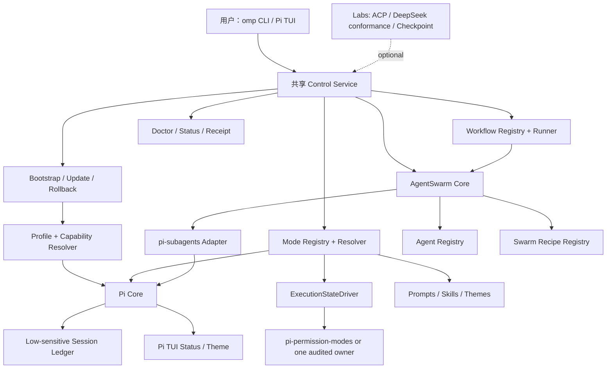
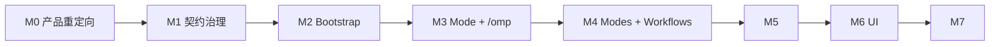

# only-my-pi：基于 Pi 的个人 Agent Harness 完整开发计划

> 版本：2026-08-16
> 状态：实施基线；后续代码和架构决策应以本计划、对应 ADR 与实际仓库证据共同为准
> 目标仓库：`only-my-pi`
> 产品目标：把现有的 Pi 资源与安全治理仓库，开发成可安装、可切换模式、可编排 AgentSwarm、可诊断、可回滚的个人 Harness 发行版

## 1. 结论与开发方向

`only-my-pi` 不应重写 Pi，也不应继续把 DeepSeek 协议、ACP 适配器或 workspace checkpoint 当作主产品。正确方向是：

1. 复用 Pi 的 agent loop、Provider、session、built-in tools、extension API 和 TUI；
2. 借鉴 DeepSeek Harness 的 Profile/Bundle、插件组合、统一策略管线、Subagent 和 Context 管理；
3. 借鉴 OpenCode 的 plan/build/review 模式、deny/ask/allow 权限和 Agent Profile；
4. 借鉴 Kimi Code 的 coder/explore/plan、声明式插件、主题与 AgentSwarm；
5. 借鉴 Aider 的 repo-map、architect/editor 分工、Git diff 与 lint/test 回路；
6. 把这些能力实现为 Pi 可直接加载的 extension、prompt、skill、theme、Profile、Mode 和 Workflow；
7. 提供一键 bootstrap、统一 `omp` CLI 与 Pi 内 `/omp` 控制入口；
8. 把 AgentSwarm 做成核心能力，但复用 `pi-subagents` 的公开接口，不再造第二套 child-agent runtime。

一句话定位：

> **only-my-pi 是“基于 Pi 的可版本化个人 Agent Harness 发行层”，而不是另一个 Agent runtime。**

### 1.1 本路线交付什么

- 一条命令初始化、升级、诊断和回滚 only-my-pi；
- 安装期的 Profile 能力上界；
- 会话期在同一硬权限 envelope 内可热切换、跨 envelope 给出安全重启方案的 Mode 系统；
- 可声明和扩展的 Agent、Workflow、Swarm Recipe；
- 基于 `pi-subagents` 的 AgentSwarm 编排；
- `coding`、`research`、`review`、`debug` 等真实工作流；
- 一个统一的 `/omp` 控制面；
- 一个轻量主题和状态呈现层；
- 完整的 doctor、负面测试、安全文档和验证收据。

### 1.2 本路线明确不做什么

- 不重写 Pi agent loop、Provider HTTP client、session engine 或完整 TUI；
- 不让 ACP、DeepSeek 协议测试、checkpoint 接管主路线；
- 不创建第二套 memory、MCP bridge、permission owner、subagent tool 或 renderer owner；
- 不在 Mode manifest 中执行任意 JavaScript；
- 不把 Project Trust、Plan Mode 名称、工具隐藏或权限弹窗本身描述成 OS sandbox；当前 `pi-permission-modes` 的 Default/Plan/Build 只会在 sandbox runtime 成功时隔离它替换的 Bash 子进程，不会自动隔离 file tools、Web/MCP/Provider 流量或任意 extension 代码；每个 enforcement surface 都必须单独显示 owner、mechanism、`active/degraded/unavailable/unknown` 和原因；
- 不默认开启 YOLO、浏览器 Cookies、Remote Shell、Cron、Creator、自修改插件或自动 Marketplace；
- 不在普通测试和 CI 中调用真实模型端点；
- 不同步 credentials、sessions、memory database、cache 或本机绝对路径。

现有 `packages/deepseek-conformance`、`packages/acp-v1` 和 `packages/workspace-checkpoint` 保留，但统一归入 Labs/Experimental。它们可以继续独立演进，不得阻塞 Harness MVP，也不得默认加载。

### 1.3 开发编排器与产品 Agent 必须分开

本计划由 **Codex** 作为外部开发 Agent 执行；Pi/only-my-pi 是被开发、测试和
打包的目标产品。两者不能互换：

- Codex `/goal` 负责跨回合目标、计划状态、代码修改、测试、独立开发子代理、Git
  提交与经授权的 feature-branch push；
- only-my-pi 在交付后负责用户任务的 Profile、Mode、Workflow、Agent Role 和
  AgentSwarm；
- `pi-subagents` 只属于产品 M5 运行时，不能被当成执行本开发计划的 Codex
  子代理框架；
- Codex Goal contract 放在 `codex/goals/`，不得放入 `prompts/`、不得写入
  `package.json#pi.prompts`，也不得要求先启动 Pi 才能开始开发；
- 对 Pi 的 no-model startup、扩展注册和 AgentSwarm 测试只是 Codex 执行的产品
  验证步骤，不是 Goal 自身的宿主。

## 2. 当前仓库基线与真实差距

截至本计划编写时，仓库已经具备：

- 精确版本的第三方 Pi 包清单；
- `minimal`、`coding`、`research`、`ui-terminal`、`experimental` Profile；
- `package-doctor`、只读 `profile-resolver`、`safe-mode`、`mcp-doctor`；
- 低敏 `session-ledger` 与 `context-doctor` Pi extension；
- DeepSeek fixture conformance、ACP v1 runtime-neutral adapter、Git workspace checkpoint；
- 43 个通过的离线测试和低敏 verification receipt 机制。

它尚未成为可日用 Harness，原因如下：

| 缺口 | 当前事实 | 目标状态 | 优先级 |
| --- | --- | --- | ---: |
| 一键初始化 | README 依赖本机绝对路径，缺少 `bin`、backup、apply、rollback | `omp bootstrap` 可预览、应用、验证、回滚 | P0 |
| Profile 契约 | 只是 package/policy 投影，不激活、不写配置 | 严格 schema、capability graph、live drift doctor | P0 |
| Mode | 完全不存在；Profile 被误当成 Mode | 独立、同硬权限 envelope 内可切换、只能收窄 Profile 的 Mode Registry | P0 |
| 统一控制面 | 只有 `/omp-context` | `/omp status|doctor|mode|swarm|safe|help` | P0 |
| 工作流 | 没有进入/退出条件、验证门禁或可执行流程 | 声明式 Workflow + Mode 绑定 | P0 |
| AgentSwarm | 只记录了 `pi-subagents` 包和描述性并发策略 | 基于公开 API 的 DAG、预算、取消、聚合与 writer 隔离 | P1 |
| 模式资源 | `skills/`、`prompts/`、`themes/` 为空 | 内置 Mode prompt、Agent role、Workflow 与纯数据主题 | P1 |
| Schema | `schema:check` 只查链接，不验证文档 | 真正执行 JSON Schema Draft 2020-12 | P0 |
| Capability 一致性 | `research` 声明启用 subagents，但 packageIds 未选 subagents，doctor 仍通过 | policy、package、runtime 三方一致，否则 fail closed | P0 |
| 发布工程 | 无 CI、typecheck、pack allowlist、CHANGELOG、release gate | 可复现 CI 与受控发布流程 | P2 |

### 2.1 第一原则：先消除“假绿色”

当前最危险的不是缺功能，而是配置声明和实际能力可能不一致。任何后续 Mode 或 Swarm 都必须建立在以下不变量上：

```text
policy 声明 capability 已启用
    ⇔ Profile 选择的 first-party/third-party resource 提供该 capability
    ⇔ Pi runtime 报告该 capability 实际可用
```

任何一层不满足都必须给出明确的 `BLOCKED`/`RESTART_REQUIRED`/`UNAVAILABLE`，不能只打印 warning 后继续。

## 3. 产品概念模型

Profile、Mode、Workflow、Agent 和 Swarm 必须分开，否则配置会再次变成一团互相覆盖的开关。

| 概念 | 生命周期 | 责任 | 是否可热切换 | 是否可扩大权限 |
| --- | --- | --- | ---: | ---: |
| Profile | Pi 启动/资源加载期 | 包、extension、memory owner、network owner、UI owner、能力上界 | 通常否 | 仅经 bootstrap + 用户确认 |
| Mode | 当前 session/任务期 | Prompt、active tools、行为约束、默认 Workflow/Swarm、验证条件 | 同一硬权限 envelope 内；否则重启 | 否，只能收窄 Profile |
| Workflow | 一次任务执行期 | 阶段、依赖、门禁、转移条件、终止条件 | 运行中不可任意改变 | 否 |
| Agent | 一个 child role | System prompt、工具白名单、模型角色、输出契约 | 每次 dispatch 解析 | 否，只能收窄父级 |
| Swarm Recipe | 一次多 Agent 编排 | DAG、并发、预算、取消、writer 策略、聚合 | 启动前解析 | 否 |
| Runtime Policy | 实时 | OS/Project Trust/Profile/Mode/Workflow/Agent 的交集 | 随状态变化 | 否，deny 优先 |

有效权限必须按单调收窄计算：

```text
OS / container capability
  ∩ Pi Project Trust
  ∩ Profile ceiling
  ∩ active Mode
  ∩ current Workflow step
  ∩ Agent role
  ∩ explicit approval
  = effective capability
```

任何子层都不能撤销上层的 deny。

### 3.1 Mode 不是 Agent Profile，Swarm 也不是一个权限 Mode

外部 Harness 的实践表明，最好把三条轴保持正交：

1. **Axis A — Task Mode**：`inspect | explore | coding | debug | research | verify | ...`，决定具体工作方法、Prompt、Workflow 和完成门禁；
2. **Axis B — Worker Agent Profile**：`scout | planner | implementer | reviewer | ...`，决定 child role 的能力收窄与输出契约；
3. **Axis C — Scheduling Recipe**：`single | pipeline | map-reduce | DAG`，决定委派和聚合方式。

`executionState = ask | plan | build | review` 是 Task Mode 解析出的内部硬策略投影，不是第四条用户轴。Profile 是 load-time capability ceiling，Workflow 是跨阶段状态机；它们也不是任务期选择轴。

因此，用户仍然可以拥有很多实用 Mode，但每个 Mode 必须声明它映射到哪个执行状态。例如 `coding → build`、`research → ask`、`verify → review`。`debug` 可以通过 Workflow 从只读调查状态显式过渡到 `build`；它不能在一次不透明的热切换中自动获得写权限。

AgentSwarm 是调度机制，不是第五个执行状态。是否允许 Swarm、允许哪些 child role、预算和隔离策略由 Mode/Profile 共同限制。

## 4. 总体架构



### 4.1 模块边界

建议按以下结构逐步重构；不要求一次性搬完现有文件：

```text
only-my-pi/
├── bin/
│   └── omp.mjs
├── packages/
│   ├── contracts/             # capability/profile/mode/agent/workflow/swarm schemas
│   ├── config-runtime/        # loader、resolver、effective policy、settings store
│   ├── bootstrap/             # plan/apply/backup/rollback/live doctor
│   ├── mode-registry/         # discover/validate/resolve/activate
│   ├── workflow-core/         # declarative phases and gates
│   ├── swarm-core/            # registry、DAG compiler、admission、aggregation、events
│   ├── adapters/
│   │   ├── pi-runtime/
│   │   └── pi-subagents/
│   ├── acp-v1/                # Labs；保留
│   ├── deepseek-conformance/  # Labs；保留
│   └── workspace-checkpoint/  # Labs；保留
├── extensions/
│   ├── omp-control/           # 唯一 /omp owner
│   ├── session-ledger/
│   └── context-doctor/
├── profiles/                  # load-time capability bundles
├── modes/                     # runtime behavior manifests + prompts
├── agents/                    # child role manifests
├── workflows/                 # single-/multi-agent workflows
├── swarms/                    # AgentSwarm recipes
├── policies/                  # capability owners/tool/network policies
├── themes/                    # pure-data semantic themes
├── schemas/
├── tests/
│   ├── unit/
│   ├── contract/
│   ├── integration/
│   └── e2e/
├── docs/
└── verification/
```

CLI 与 Pi extension 必须调用同一套 library/service，禁止各自实现一份 resolver、DAG compiler 或 admission policy。物理 child scheduler 始终归 `pi-subagents`。

## 5. 可扩展 Mode 系统

### 5.1 Mode v1 的设计目标

- 新增 Mode 只需要增加 manifest 和资源文件，不改核心 switch/case；
- Mode 是纯声明式数据，不允许任意 JS/TS；
- 每次解析得到 immutable resolved snapshot、content hash 和 explain 输出；
- Mode 只能收窄当前 Profile，不得隐式安装包或扩大 network/write 权限；
- 需要新资源时返回 `RESTART_REQUIRED`，并给出可审查的 Profile diff；
- 项目 Mode 只有在 Project Trust 后才发现；
- ID 冲突、继承循环、路径/符号链接逃逸、未知 capability 全部 fail closed；
- Mode 可被 CLI、Pi TUI、Workflow 与 AgentSwarm 共用。

### 5.2 推荐 Mode manifest

```json
{
  "$schema": "../../schemas/mode-v1.schema.json",
  "formatVersion": 1,
  "id": "coding",
  "version": "1.0.0",
  "displayName": "Coding",
  "description": "Guarded implementation with tests and review.",
  "category": "primary",
  "executionState": "build",
  "extends": ["base-guarded"],
  "requires": {
    "profileCapabilities": ["workspace-write", "permission-policy"],
    "packages": [],
    "enforcementSurfaces": ["toolCallPolicy", "fileToolPolicy"]
  },
  "prompt": {
    "file": "prompt.md"
  },
  "tools": {
    "allow": ["read", "grep", "find", "ls", "edit", "write", "bash"],
    "deny": [],
    "required": ["read", "edit"]
  },
  "policy": {
    "workspace": "guarded-write",
    "egress": {
      "web": "deny",
      "mcp": "deny",
      "provider": "profile",
      "extension": "profile"
    },
    "approval": "ask",
    "projectTrust": "ask",
    "permissionModeRef": "build"
  },
  "workflow": "plan-build-review",
  "swarm": {
    "availability": "optional",
    "recipe": "coding-guarded",
    "enabled": true,
    "requires": {
      "packages": ["subagents"],
      "capabilities": ["subagent-rpc-v1", "async-spawn", "stop"]
    },
    "fallbackWorkflow": "single-agent-safe",
    "maxDepth": 1,
    "maxConcurrency": 3,
    "maxChildren": 8,
    "writerIsolation": "single-writer-or-worktree",
    "reviewGate": true
  },
  "verification": {
    "required": true,
    "suite": "coding"
  },
  "ui": {
    "badge": "CODE",
    "semanticColor": "modeCoding"
  },
  "risk": {
    "tier": "guarded-write",
    "experimental": false
  }
}
```

最终 schema 可调整字段名，但必须保留以下语义：版本、标识、资源引用、能力与 enforcement-surface 需求、工具收窄、逐 egress surface 策略、Workflow、Swarm、验证和风险等级。

### 5.3 发现与命名空间

Mode 来源按下列层级发现，但不采用静默覆盖：

1. only-my-pi 内置 `modes/`；
2. 用户目录 `~/.pi/agent/only-my-pi/modes/`；
3. 已信任项目 `.pi/only-my-pi/modes/`；
4. 已审计 package 通过注册 API 提供的 Mode。

命名建议：

- 内置：`coding`、`research`；
- 用户：`user:<id>`；
- 项目：`project:<id>`；
- 第三方：`<package>/<id>`。

v1 不允许覆盖内置 ID。需要派生时使用 `extends` 和新命名空间。Alias 必须全局唯一，否则拒绝加载。

### 5.4 继承与策略合并

Mode resolver 必须使用 schema-aware、单调收窄的合并规则：

- metadata：子层显式值覆盖；
- prompt sections：按父到子顺序组合，并记录每段 source/hash；
- required capabilities/packages：取并集；
- tool allow：父 allow 与子 allow 取交集；子未提供时继承父值；
- tool deny：取并集，deny 优先；
- network/workspace/approval：只能保持或收紧，不能放宽；
- budget：使用各层最小上限；
- swarm depth/concurrency/children：使用最小上限；
- `experimental=false` 不得被未授权项目资源改成 `true` 并自动启用危险能力；
- 继承图必须无环，解析深度设置硬上限。

### 5.5 ExecutionStateDriver：硬策略必须只有一个 owner

`setActiveTools` 和 prompt 注入不足以兑现 workspace/network/approval/sandbox。当前已治理的 `pi-permission-modes@2.2.0` 自己拥有工具可见性、`tool_call` allow/ask/deny、file-tool path policy，以及它替换的 Bash 子进程内的 network/sandbox enforcement；它不控制 Provider、`pi-web-access`、MCP transport 或任意 extension lifecycle 网络。它的 `setMode()` 是 extension 内部闭包，包没有公开的跨扩展热切换 API。only-my-pi 不得导入其未公开 `src/**`，也不得在它仍加载时建立第二个 permission/tool-visibility owner。

M1 必须先完成 compatibility spike，并在 M3 前选择一个唯一 driver：

```ts
interface ExecutionStateDriver {
  probe(): Promise<{
    owner: string
    version: string
    canReadState: boolean
    canSwitchAtRuntime: boolean
    reportableEnforcementSurfaces: string[]
  }>
  read(): Promise<{
    executionState: "ask" | "plan" | "build" | "review" | "unknown"
    permissionMode: string | "unknown"
    enforcement: Record<
      | "toolCallPolicy"
      | "bashSandbox"
      | "fileToolPolicy"
      | "webEgress"
      | "mcpEgress"
      | "providerEgress"
      | "extensionEgress",
      {
        owner: string | "none" | "unknown"
        mechanism: "os-sandbox" | "tool-policy" | "allowlist" | "outer-sandbox" | "none" | "unknown"
        state: "active" | "degraded" | "unavailable" | "unknown"
        scope: string
        reason?: string
      }
    >
  }>
  apply(snapshot: EffectivePolicySnapshot): Promise<
    | { status: "applied"; receipt: PolicyReceipt }
    | { status: "restart-required"; launchArgs: string[] }
    | { status: "unavailable"; reason: string }
  >
  restore(receipt: PolicyReceipt): Promise<void>
}
```

允许的实现路径只有两种：

1. 使用一个经审计、具有公开状态/切换 API 的 permission owner，only-my-pi 只做 policy composition；
2. 如果未来决定让 only-my-pi 成为唯一 owner，则先从对应 Profile 移除其它 owner，并经过独立安全审计。

v1 优先第一条。若当前版本没有公开 API：

- 初始执行状态通过 `--perm <mode>` 或 `PI_PERMISSION_MODE` 绑定；
- 同一硬 permission envelope 内可热切换 Task Mode 的 prompt/Workflow；
- 跨 envelope 返回 `EXECUTION_STATE_DRIVER_UNAVAILABLE` 或 `RESTART_REQUIRED`，给出安全启动参数；
- `/omp status` 按 surface 显示 enforcement matrix；取不到实态时显示 `unknown`，绝不把 Bash sandbox 的 `active` 汇总成“整个 session 已隔离”；
- 绝不模拟 `/perm` 输入、导入私有函数，或把 `setActiveTools` 结果说成硬策略已生效。

M3 的关键顺序测试：`/omp mode use review → /perm build` 不能重新暴露 review deny；反向 `/perm plan → /omp mode use coding` 也不能放宽 plan ceiling。没有可用唯一 driver 时，这两个操作必须 fail closed，而不是产生两个竞争 owner。

### 5.6 内置 Mode 路线

不把产品固定成三个 Mode，但也不为数量制造别名。建议分三层交付：

#### Core v1：首发必须可用

| Mode | 执行状态 | 主要场景 | 写入 | 网络 | 默认 Swarm | 完成门禁 |
| --- | --- | --- | ---: | ---: | --- | --- |
| `inspect` | `ask` | 陌生仓库、结构查看、安全起步 | 否 | 否 | 无或单 scout | 结构与风险摘要 |
| `explore` | `ask` | 深度代码发现、调用链、repo-map | 否 | 否 | parallel scouts 可选 | 证据化映射 |
| `plan` | `plan` | 方案、依赖、风险与验收设计 | 否 | 默认否 | planner + reviewer 可选 | 可执行计划获确认 |
| `coding` | `build` | 日常功能实现 | 有保护 | 默认否 | `coding-guarded` | diff + tests + review + verify |
| `debug` | `plan` | 复现、假设、根因 | 否 | 默认否 | `debug-hypotheses` | 根因证据与修复建议；批准后 Workflow 转 `coding/build` |
| `review` | `review` | 代码质量、安全、回归评审 | 否 | 否 | `review-matrix` | severity/evidence/verdict |
| `research` | `ask` | 官方资料与社区证据研究 | 否 | 需要独立 egress allowlist owner；缺失则 `UNAVAILABLE` | `research-synthesis` | 来源核验 + 综合报告 |
| `verify` | `review` | 只运行 allowlisted 检查 | 否 | 否 | tester/verifier 可选 | receipt 或明确 FAIL |

#### Core+：接口稳定后增加

| Mode | 价值 | 关键边界 |
| --- | --- | --- |
| `test` | 专门编写/运行测试、定位 flaky | 测试文件写入与产品代码写入分开审批 |
| `docs` | 文档、示例、迁移指南 | 路径 allowlist，不能借文档任务改源码 |
| `refactor` | 行为保持的结构优化 | 必须先锁定测试和 public contract |
| `architect` | ADR、模块边界、依赖与演进设计 | 默认只读，不直接落实现 |
| `orchestrate` | 人类主导的复杂 AgentSwarm | 不允许父 Agent 自己成为共享目录 writer |

#### Labs：不进入默认层

- `security-audit`：需先完成专用规则和报告契约；
- `release`：需发布权限和 protected workflow；
- `maintenance`：依赖升级必须走 package governance；
- `benchmark/eval`：需稳定数据集和成本预算；
- `creator/self-modifying`：v1 明确不实现。

### 5.7 Mode 激活流程

```text
/omp mode use coding
  → discover + validate
  → resolve inheritance/resources
  → compare current Profile ceiling
  → probe the single ExecutionStateDriver
  → compute effective tool/policy/enforcement-surface diff
  → if widening/driver conflict/hard-state change: refuse or RESTART_REQUIRED
  → if safe hot switch: require idle session
  → ask the single ExecutionStateDriver to apply hard tool/policy changes
  → if the driver cannot prove the intersection: refuse or RESTART_REQUIRED
  → inject resolved prompt on before_agent_start
  → persist mode id/version/hash + low-sensitive resolved policy projection + driver receipt
  → update status badge
  → append low-sensitive mode_changed receipt
```

Mode 切换后必须能 `/omp mode show --resolved`，并解释每项能力来自哪个 Profile/Mode/Workflow 层。恢复时若 source hash 已变化，进入更严格的 `STALE_MODE_SNAPSHOT`，要求重新批准；不得静默用新定义替换旧 session 行为。

## 6. Workflow 系统

### 6.1 为什么需要独立 Workflow

Mode 描述“当前工作方式”，Workflow 描述“这次任务如何从开始走到完成”。二者不能混为一体，否则未来无法让多个 Mode 复用同一流程，或让一个 Mode 选择单 Agent/Swarm 两种执行方式。

Workflow v1 首发只使用纯 JSON 声明；不引入第二种 YAML parser，也不支持表达式求值：

```json
{
  "formatVersion": 1,
  "id": "plan-build-review",
  "fallback": {
    "when": ["missing-package", "missing-capability", "unavailable-runner"],
    "workflow": "single-agent-safe",
    "requiresApproval": false
  },
  "steps": [
    {
      "id": "inspect",
      "action": "agent",
      "agent": "scout",
      "policyRef": "inspect"
    },
    {
      "id": "plan",
      "action": "agent",
      "agent": "planner",
      "policyRef": "plan",
      "needs": ["inspect"]
    },
    {
      "id": "implement-and-review",
      "action": "swarm",
      "recipe": "coding-guarded",
      "policyRef": "coding",
      "needs": ["plan"],
      "approval": "user"
    },
    {
      "id": "final",
      "action": "gate",
      "gate": "verifier-pass",
      "needs": ["implement-and-review"]
    }
  ],
  "terminal": {
    "step": "final",
    "acceptedVerdicts": ["pass"],
    "rejectedVerdicts": ["fail", "blocked"]
  }
}
```

v1 不执行任意脚本，也不提供通用条件表达式。所有 gate、terminal verdict、fallback reason 和 transition 都来自 versioned schema 中的固定枚举；未知值直接拒绝。

Workflow 只拥有阶段状态机；Swarm Recipe 只拥有某个 `action: swarm` step 内部的 child DAG。`policyRef` 编译成该 step/child 的 immutable policy snapshot，不调用 session-global `/omp mode use`。并行 child 可以同时使用不同的收窄快照，但不能竞争修改父 session 的 active Mode。

`single-agent-safe` 将 `action: swarm` 显式降级为串行 `action: agent`，不复制另一张相同 DAG。

M4 只要求 `action: agent|gate` 和 Agent role registry 可执行；`action: swarm` 在 M5 adapter 可用前必须解析为 `UNAVAILABLE` 并进入 manifest 明确声明的 `single-agent-safe` fallback。M5 才激活 `action: swarm`，不得在 M4 用 mock runner 冒充 live Swarm。

### 6.2 M4 的真实单 Agent 执行面

M4 必须完整交付 `WorkflowCore`：schema/registry、transition validator、durable stage state、resume/cancel、terminal verdict 和 runner interface。其首个 backend 是 `SingleAgentWorkflowRunner`，直接复用当前 Pi parent session，而不是伪造 child runtime：

- `action: agent` 把已解析的 Agent role prompt/policy overlay 注入当前 session 的下一轮 `before_agent_start`，一次只允许一个 stage；
- stage 只能通过 versioned `omp_workflow_report` 结果或 deterministic gate receipt 前进，不能靠自由文本声称完成；
- runner 不递归调用模型、不启动 child、不并行，也不要求 `pi-subagents`；
- durable state 记录 workflow/stage/version/hash/terminal reason，恢复时执行 source/hash drift check；
- fake/injected runner 用于确定性 E2E，Pi no-model smoke 证明注册、映射、取消、dispose 和恢复 contract；真实模型调用仍需单独授权。

`DeterministicGateRunner` 同属 M4：只接受 versioned allowlist 中的 command + argv，`shell:false`、固定 cwd containment、显式父级批准、timeout/output bound 和低敏 receipt；它不把任意 Bash 交给 tester/verifier。M5 只新增 child/Swarm backend，并复用这一 Workflow Core 与 Gate Runner。

### 6.3 首发工作流

1. `plan-build-review`：Inspect → Plan → Build → Test + Review → Verify；
2. `research-report`：Question framing → Parallel sources → Source verification → Synthesis；
3. `review-findings`：Diff map → Quality/Security/Test review → Findings aggregation；
4. `debug-fix-verify`：Reproduce → Hypotheses → Root cause → Guarded fix → Regression；
5. `single-agent-safe`：无 Swarm 时的安全降级路径。

每个 Workflow 必须定义：进入条件、允许变更范围、预算、取消语义、失败状态、最终输出 contract 和恢复方式。

## 7. AgentSwarm 核心设计

### 7.1 定位

AgentSwarm 是 only-my-pi 的核心卖点之一，但它不是新的 Agent runtime。架构应是：

```text
Swarm Core
  ├── Role/Recipe Registry
  ├── DAG Compiler
  ├── Admission + Budget Intersection
  ├── Capability Preflight + Provenance
  ├── Result Aggregator + Verifier
  └── Runner Adapter
         └── PiSubagentsAdapter（首发唯一 live runner backend）
```

现有 `pi-subagents` 已提供 delegation、foreground/background/parallel、preflight、capability ceiling、worktree、usage budget、child lifecycle、stop/resume 和 extension RPC。only-my-pi 只负责 schema/registry、DAG 验证、admission、预算交集、可信编译、结果归一化和 verifier gate；物理 child dispatch、进程生命周期、并发、worktree 创建/清理与 stop/resume 由 `pi-subagents` 独占。only-my-pi 不注册第二个 `subagent` 工具，不再实现逐 child scheduler/semaphore。

only-my-pi 可以限制同时 active 的顶层 Swarm run 数，并把 `maxConcurrency` 编译进 `pi-subagents` workflow；这不是第二套 child scheduler。

当前 `pi-subagents@0.45.2` 有 exported `./delegation` 与 extension RPC 两个上游 surface，但 only-my-pi v1 的 live runtime 只采用进程内 extension RPC：

- exported `./delegation` 仅作为 M1 contract fixture/dev reference；Pi packages 具有独立 module root，在没有 host-supported resolver 前不得从 only-my-pi runtime 跨包静态 import；
- extension RPC `workflowScript` 承载 async/sequence/parallel/worktree/status/stop 等 package-owned runtime 能力，使用前必须 `ping`/capability negotiation；
- 如果未来 Pi 提供受支持的跨包 delegation resolver，必须新 ADR、dependency/topology test 和 capability negotiation 后才可增加第二条 adapter lane。

不得导入未 export 的 `src/**` 类型。Adapter 维护经过测试的 wire contract fixture，并在每个 parent session 首次运行时记录 capability snapshot/hash。缺少必需 capability 时在启动任何 child 前失败或进入声明式 fallback。

Mode/Workflow/Recipe 和 CLI 永远不能提供 raw `workflowScript`。只有 schema-validated DAG compiler 可以生成固定模板脚本；task、path、label 和数据使用 JSON-safe serializer/AST builder 注入，禁止字符串拼接源码，并覆盖 script/task injection 负面测试。

ACP、Codex、Claude 或 remote agent 只作为未来 adapter seam；MVP 不要求接通。

### 7.2 Agent role v1

首发角色：

- `scout`：只读映射代码与证据；
- `planner`：生成可执行计划，不修改文件；
- `implementer`：唯一默认 writer；
- `tester`：运行 allowlisted checks，默认不修改产品代码；
- `reviewer`：质量、回归与契约审查；
- `security-reviewer`：专注 trust/path/secret/process/network；
- `researcher`：只读网络/文档研究；
- `source-verifier`：核对来源与时效；
- `verifier`：根据 Definition of Done 给最终 verdict；
- `synthesizer`：只聚合结果，不凭空增加结论。

Agent manifest 至少包含：role id/version、prompt、tool allow/deny、`allowedExecutionStates`、required capabilities、policy ceiling、模型角色、输入/输出 schema、是否 writer、timeout、可否继续/恢复和 redaction policy。Agent 不绑定用户 Task Mode，避免把 Axis A/B 再次耦合。

`pi-subagents` runtime 接受已注册 agent id，不接受 only-my-pi 临时 inline Agent。Build/pack 必须把已验证的 JSON role 确定性编译为 package-owned pi-subagents Markdown agent resource（或映射到已存在的 agent id），并通过 `pi.subagents.agents` 注册；生成、对账、冲突、namespace 和 hash 都要有测试，Bootstrap 只启用已打包资源。

当前 0.45.2 的 Agent permissions 不接受 `bash` policy；bash gating 属于另一 owner。不能在 reviewer/tester manifest 中写 `permissions.bash=deny/ask` 后宣称已强制。v1 规则：

- scout/reviewer/researcher/source-verifier 从 tools/capability ceiling 中彻底移除 bash；
- tester/verifier 需要的 lint/test/build 由确定性 allowlisted Gate Runner 执行，child 不获得任意 bash；
- implementer 是首发唯一可持有 bash 的 role，仍受 ExecutionStateDriver、逐 surface enforcement matrix、worktree/outer-sandbox 实态和 approval；
- adapter launch-contract fixture 必须证明工具移除在 child 启动时实际生效。

M5 必须生成 child policy projection matrix，将 manifest 每个字段标为 `ENFORCED | RESTART_REQUIRED | UNSUPPORTED` 并记录 enforcement owner/surface。当前 public ceiling 主要能表达 allowed tools/agents 与 denied extensions，不能独立表达 file tools、Web/MCP/Provider/extension egress 或完整 workspace sandbox；无法投影的硬要求必须 admission fail closed，不能靠 prompt 宣称已强制。

默认投影：只读 roles 移除 `bash/edit/write`；tester/verifier 走固定 Gate Runner；writer 才可能获得 bash/edit/write。Bash sandbox、file-tool policy、Web/MCP/Provider/extension egress 必须由对应 owner/outer isolation 与实际 child launch contract 分别证明。

### 7.3 首发 Swarm Recipes

#### `research-synthesis`

```text
2-4 个领域不同的 researcher 并行
  → source-verifier 交叉核验
  → synthesizer 形成单一报告
```

默认只读，可作为第一个真正 E2E 的 Swarm。

#### `coding-guarded`

```text
scout → planner → 单 writer implementer
                         ├→ tester
                         └→ reviewer
                tester + reviewer → verifier
```

tester 与 reviewer 必须基于 writer 已完成的稳定快照；verifier 未通过不得宣称完成。

#### `review-matrix`

```text
quality-reviewer + security-reviewer + test-analyst 并行
  → findings aggregator 去重、定级、给 verdict
```

全流程只读；任何修复必须切换到 coding/fix Workflow。

#### `debug-hypotheses`

```text
多个只读 hypothesis scout
  → 只读 reproducer / allowlisted Gate Runner 选择可证伪路径
  → root-cause verifier 输出证据与建议
```

该 Recipe 在 `debug/plan` ceiling 内结束，绝不包含 writer，也不获得 `edit/write/bash`。`debug-fix-verify` Workflow 只有在根因 gate 通过、用户明确批准且 ExecutionStateDriver 完成 `coding/build` 转换或安全重启后，才调用独立的 `coding-guarded` 修复阶段；不能让 debug Recipe 自己扩权。

### 7.4 Admission 与预算默认值

个人本机安全默认：

| 项 | 默认 | 原因 |
| --- | ---: | --- |
| 最大深度 | 1 | 禁止无意递归 Swarm |
| 最大并发 child | 3 | 控制本机资源与费用 |
| 单次最大 child 数 | 8 | 防止 fanout 爆炸 |
| 单 child wall timeout | 15 分钟 | 可取消、可恢复 |
| 总 wall timeout | 60 分钟 | 避免后台失控 |
| shared cwd writer | 1 | 消除并行覆盖 |
| nested swarm | 默认关闭 | 需显式实验开关 |
| reviewer context | fresh | 避免继承 writer 自证偏差 |
| max retry/item | 0（仅明确 transient 可设 1） | 避免隐式重复副作用 |
| child raw output | 50 KiB | 有界 artifact |
| parent summary | 8 KiB | 避免主上下文膨胀 |
| aggregator order | declaredIndex → nodeId → attemptId | 与完成速度无关 |

所有层复用一个 `BudgetEnvelopeV1`，有效值取 Profile、Mode、Workflow、Recipe、Agent、run override 与 `pi-subagents` runtime limit 的最小上限。Goal API token budget 与产品 Swarm budget 是完全不同的两类预算。

如果 runtime 提供可靠 token/cost usage，则加入总预算和 per-role 预算；如果没有，必须显示 `UNAVAILABLE`，使用并发、任务数、timeout、turn 和 output 上限作为可验证替代，不能伪造精确成本控制。当前 usage limit 若只阻止未来 child launch、不能终止 in-flight child，UI 应写 `OBSERVED_NO_NEW_SPAWN_LIMIT`，不能承诺绝不超额。Retry、reducer 和 verifier 都消耗同一预算。

不要对 mutation worker 施加过紧的硬 tool-call 数量限制：tool budget 可能阻止必要的读取，却不能保证没有危险写入。写入安全应由 capability ceiling、single-writer/worktree、审批、checkpoint 与 verifier 共同保证。

### 7.5 Writer 安全模型

- 父 Agent 只负责 orchestration，不作为共享目录 writer；
- 默认一个 writer 直接拥有明确文件范围；
- shared cwd 的 writer hard max 永远是 1；
- 并行 writer 必须各自使用独立 managed Git worktree；file claim 只是二级 scope guard，不能替代 worktree；
- worktree preflight 要求可追溯的 clean `baseCommit`；dirty checkout 不得静默忽略；
- 当前 `pi-permission-modes@2.2.0` 在真实 Git worktree（`.git` 为文件）会把 Bash 子进程 OS sandbox 降级为 prompt；worktree 解决 Git/文件隔离，不等于 whole-session OS sandbox。需要跨 surface OS 隔离的 writer 应使用正常 clone + verified sandbox 或 container/VM；
- 每个 writer prompt 必须写明 ownership 与“不得回滚他人修改”；
- 合并前检测文件重叠；冲突时停止，不自动覆盖；
- 有改动的 worktree 在 integrator/用户接受前保留；单一 integrator 串行合并；
- tester/reviewer 必须绑定 writer settled 后的同一 stable handoff snapshot；最终 verifier 在 integration checkout 重跑；
- reviewer/tester 默认只读；
- child 的有效权限重新计算，不能直接继承父级的“Always allow”；
- parent cancel 必须向所有 running child 传播；
- cancel 后不得再调度新 child；
- child 失败保留 partial result 和 terminal state，不无限重试；
- ledger 只记录 task id、role、状态、hash、时间和预算，不记录原始 reasoning、secret 或不必要的 prompt。

Run 状态闭集：`planned | admitted | running | stopping | completed | failed | cancelled | timed_out | budget_exhausted | interrupted`。Item 状态闭集：`queued | running | completed | failed | timed_out | cancelled | skipped_dependency_failed | skipped_run_cancelled | budget_exhausted`。

`/omp swarm cancel`、父 session abort 和 run timeout 都调用 package-owned root `stop`。`stopping` 只代表请求已送达，必须等 runtime terminal proof 才记录 `cancelled`。Cancel 原子关闭 admission；queued item 进入 `skipped_run_cancelled`，running item等待 package 终态；cancel 后不运行 reducer/verifier，不 retry/resume。`dispose()` 幂等并有有界等待。Resume 必须重新经过 root admission/budget，不能借 resume 扩权。

Provenance 至少记录：schema/seq、workflowRunId/swarmRunId/nodeId/attemptId、parent session/tool call、resolved Profile/Mode/Agent/Recipe version+hash、executionState/effectivePolicyHash、pi-subagents request/run/launch digest、cwd/worktree/baseCommit/handoff hash、requested/resolved/actual budget、started/settled/terminal reason 和 bounded artifact refs。每个 authoritative `child.started` 恰有一个 `child.settled`；模型文本不能冒充 runtime terminal record。

### 7.6 AgentSwarm 控制面

CLI：

```text
omp swarm list
omp swarm show <recipe>
omp swarm validate [recipe]
omp swarm plan <recipe> [--input-file <path>]
omp swarm run <recipe> [--input-file <path>] [--yes]  # v1 可启动明确的 headless Pi parent；否则返回下述错误
omp swarm status [run-id]
omp swarm cancel <run-id>
```

Pi TUI：

```text
/omp swarm list
/omp swarm show <recipe>
/omp swarm plan <recipe>
/omp swarm run <recipe>
/omp swarm status
/omp swarm cancel <run-id>
```

`pi-subagents` RPC 是 Pi 进程内 event bus。v1 必须明确选择：CLI live `run/status/cancel` 启动并管理一个加载相同配置的 headless Pi parent；如果未实现该 transport，则这些 CLI 命令返回 `LIVE_SWARM_REQUIRES_PI_SESSION`，只有 `/omp` TUI 提供 live control。CLI 的 `list/show/validate/plan` 始终可离线运行，不能尝试向不存在的 event bus 发 RPC。

`plan` 永远零执行、零写入，必须输出 DAG、roles、工具/权限、并发、预算、writer/worktree 和将发送给 child 的输入摘要。`run` 才表示实际启动：交互终端在 mutating preflight 后请求批准；非交互 mutation 必须由用户直接调用时显式传 `--yes`。删除 `--apply`，避免和 bootstrap/update 的 plan/apply 语义混用；`/omp swarm run` 始终走 TUI 父级批准，child 不能代批。Parser 必须拒绝 `--apply`、模糊 `--input` 和未经批准的 mutation。缺少 `pi-subagents` 或公开 capability 时 fail closed，或仅在 manifest 声明允许时使用 `single-agent-safe` fallback。

## 8. 一键 Bootstrap、更新与回滚

### 8.1 用户体验

开发态：

```bash
node bin/omp.mjs bootstrap --profile coding --mode coding --dry-run
node bin/omp.mjs bootstrap --profile coding --mode coding --apply
```

安装后的目标体验：

```bash
omp bootstrap --profile coding --mode coding
```

默认先显示 plan 和 diff；交互确认后 apply。无人值守必须显式 `--yes`。一键不等于静默改配置。

“一键 bootstrap”从**已取得并验证的 only-my-pi artifact**开始，不把 Node/Pi 安装、Git clone 或 npm publish 偷藏进同一个承诺。v1 prerequisites 必须写清兼容 Node/Pi 版本；在尚未授权 npm publish 时，artifact 来源只允许：

- 固定 commit SHA 的 Git checkout；开发时从 repo root 使用 `pi -e .` / `pi install .`；
- 由该 source SHA 本地 `npm pack` 生成、记录 integrity 的 tarball。

M7 必须在全新临时目录中把 tarball 以 scripts-disabled 方式安装到临时 prefix，验证 `bin.omp`、shebang/executable、无 checkout 依赖，再用临时 `PI_CODING_AGENT_DIR` 执行 bootstrap → second no-op → rollback。Publish、global install 和真实 Pi home 仍需单独授权。

### 8.2 Bootstrap 流程

```text
preflight
  → validate repository/package/inventory/schemas
  → inspect Node/Pi/Git/platform
  → resolve Profile + default Mode（M3 后）
  → optionally select provider/model metadata without reading auth or calling endpoint
  → reconcile installed packages/resources
  → render redacted plan/diff
  → confirm
  → acquire exclusive lock + create durable transaction journal
  → backup only owned target files and record rollback hashes
  → stage/install exact reviewed package resources without publishing settings
  → verify staged integrity/resources and render the final owned-field merge
  → atomically publish settings as the final visibility point, preserving unknown fields
  → static doctor
  → isolated/no-model startup smoke
  → mark transaction committed + record last-known-good + rollback command
```

任一步失败必须按 journal 恢复到 bootstrap 前状态，且保留脱敏诊断信息。进程在任何 phase boundary 崩溃后，下一次 `omp` 必须先检测未完成 transaction 并恢复或完成安全回滚；不得留下“settings 已引用、package 尚不存在”的可见状态。如果 Pi 的安装 API 无法原子 stage，package reconciler 必须使用隔离 config/package root 或 durable compensating rollback，仍然遵守“资源先就绪、settings 最后发布”。不可触碰：auth、model key、sessions、memory DB、browser Cookies 和 cache。

Package staging 默认强制 `--ignore-scripts`/`npm_config_ignore_scripts=true`，只接受 inventory 中 exact spec + tarball integrity。不得直接依赖 Pi 0.84.1 当前会调用普通 `npm install` 的 managed path 来兑现这一保证。确实需要 lifecycle 的 package 必须在 inventory 记录 script name、内容 digest 与必要性，并只在无凭据、最小挂载的外层 OS sandbox/container 中执行；没有该边界就标 `UNAVAILABLE`。Transaction snapshot/rollback 覆盖 only-my-pi-owned 的完整 managed npm metadata/package graph，而不只是 settings；未知用户 package graph 保持不变。用恶意 lifecycle fixture 证明 scripts-disabled staging 不产生 host side effect，并覆盖 install 后 crash 的精确恢复。

Provider/model 选择只保存非敏感 ID；未发真实请求前显示 `CONFIGURED_UNVERIFIED`。如果用户不选择，Bootstrap 只输出 Pi `/login` 与 `/model` 指引。一键初始化不以获取密钥为代价。

### 8.3 必须支持的命令

```text
omp bootstrap [--profile] [--mode] [--provider] [--model] [--scope] [--dry-run|--apply] [--yes]
omp doctor [--static|--live] [--json]
omp status [--json]
omp update --plan
omp update --apply
omp rollback [snapshot-id]
omp uninstall --plan
omp uninstall --apply
omp safe
```

`update` 只对账 inventory 中已审计、精确 pin 的版本；默认 plan，apply 必须显式。更新前 backup，失败恢复 last-known-good；不自动升级 Pi 本体、不跟随 `latest`、不执行未知 lifecycle script。

### 8.4 配置与测试隔离

- 核心 settings store 必须接受显式 `configRoot` 依赖；
- unit/integration tests 只写临时目录；
- 测试不读取或修改真实 `~/.pi`；
- 当前 Pi 提供 `PI_CODING_AGENT_DIR` 作为配置目录 seam；真实 Pi startup E2E 将它指向专用临时目录，并同时使用 `--offline`、`--no-session` 和无 Provider 调用路径；未来版本若移除该 seam，则改用 disposable container/user，而不是伪造已隔离；
- 不通过提交本机路径实现“一键”；
- backup 权限最小化，恢复前校验 ownership/hash；
- unknown settings 字段必须保留；
- 第二次执行应成为 no-op。

## 9. 统一 `omp` / `/omp` 控制面

新增唯一 command owner `extensions/omp-control/index.ts`。`/omp-context` 可以保留为兼容 alias，但内部调用共享 service。

### 9.1 命令设计

```text
/omp
/omp status
/omp doctor
/omp profile list|show|diff
/omp mode list|show|use|reset|doctor
/omp swarm list|show|plan|run|status|cancel
/omp tools
/omp packages
/omp context
/omp verify
/omp theme list|preview|use
/omp safe
/omp help
```

公共命令必须有唯一 owner 和退出门禁：

| Command group | Shared service | Owner milestone | Required test |
| --- | --- | --- | --- |
| root/status/doctor/profile/mode/tools/packages/context/verify/safe/help | Control/Profile/Mode/Doctor/Context/Verification services | M3 | parser + CLI/TUI equivalence + unknown/degraded state |
| swarm | Swarm Core | M5 | plan/approval/run/status/cancel + unavailable transport |
| theme | Theme service | M6 | schema/preview/use/safe-disable |

`extensions/omp-control` 是 `/omp` 与兼容 `/omp-context` 的唯一注册者。M3 时 `context-doctor` 改为只导出共享 service，不再自行注册 alias；迁移测试必须证明每个 command name 恰好注册一次。若某命令不交付，就必须从公开清单和 DoD 同时删除，不能保留幽灵承诺。

TUI 内不适合执行的安装、恢复或 destructive 操作，只显示 plan 和对应 CLI 命令，不降低原有二次确认。

### 9.2 状态模型

尽可能展示：only-my-pi 版本、Profile、Mode、model、thinking、active tools、permission、逐 surface enforcement matrix（Bash/file/Web/MCP/Provider/extension）、memory owner、subagents、Git branch/dirty、context usage、active swarm、package drift 和 restart-required。

Pi API 取不到的字段必须显示 `unknown`/`unavailable`，不得猜测。

## 10. UI 与主题

UI 的目标是可读和可诊断，不是重写 Pi TUI。

- 主题使用 semantic tokens，再映射为 Pi theme JSON；
- 首发一个 dark 主题；light 主题可在后续小版本加入；
- Mode badge、permission、context、Git dirty、swarm active count 使用 Pi 公开 status/widget API；
- 同时只允许一个 renderer owner、一个 footer/status owner、一个 editor owner；
- safe mode 一键禁用 UI extension；
- UI 失败不能阻止 `inspect`/minimal 启动；
- 主题包不得包含行为代码；
- 增加 required token、颜色格式和对比度检查；
- 第三方 `pi-terminal-theme` 等保持 trial，完成人工视觉 QA 后才 promotion。

## 11. 详细里程碑与实施顺序

### M0：产品重新定向与 Labs 下沉

目标：所有文档和导航承认主线是 Pi Harness 发行层。

任务：

- 新增产品边界 ADR；
- 更新 README/STATUS，让 bootstrap、Mode、Workflow、AgentSwarm 成为主路线；
- 新增 Labs 页面，收纳 ACP、DeepSeek conformance、checkpoint；
- 建立本计划与外部 Codex Goal execution contract；该文件不得进入 Pi `prompts/` resource；
- 保留现有测试基线。

验收：

- README 不再把真实 DeepSeek endpoint/ACP wiring/checkpoint hook 列为下一主线；
- Labs 明确非默认加载和真实集成状态；
- 文档链接无断链；
- `npm test` 与现有 doctors 全绿。

### M1：契约与治理硬化

目标：消除“声明启用但实际没有”的假绿色。

任务：

- 引入真正的 Draft 2020-12 schema validation；
- 在 runtime 实现之前先定义 `mode-v1`、`agent-v1`、`workflow-v1`、`swarm-recipe-v1`，连同 inventory/profile/capability/owner schema；每类至少一个 positive fixture 和 unknown-field/version/reference/cycle/escalation 等 negative fixtures；
- 严格检查 npm exact semver、Git commit SHA 和 source integrity；
- 建立 capability/owner schema；
- 升级 Profile schema，严格定义 policy；
- 修复所有 Profile/Mode/Workflow 的 subagent mismatch：基础 `coding` 保持单 Agent fallback；新增显式含 `subagents` 的 orchestration/coding-swarm Profile，或经 ADR 决定将其纳入 coding 但默认不 fanout；
- 将 first-party extensions/themes/modes 纳入 inventory；
- 新增 package dependency topology ADR：Pi host packages 放 `peerDependencies: "*"`，CI/typecheck 用精确 devDependencies；validator/TypeScript 等直接依赖显式声明；提交 lockfile；
- 增加 `npm ci`、typecheck 与 pack-content allowlist；
- 明确 `pi-subagents` 继续作为独立加载的唯一 runtime owner；only-my-pi live adapter 只走 versioned extension RPC wire，不跨 package root 静态 import，也不 bundle/启动第二份 extension runtime；
- Agent Markdown 资源随 only-my-pi tarball 交付并通过 `package.json` 的 `pi.subagents.agents` 注册；若 JSON 是 canonical source，则 build/pack 时确定性生成并校验 hash，不在 bootstrap 时改写已安装包或用户目录；
- doctor 分为 static/live，live 只读取非敏感 metadata；
- 完成 `pi-permission-modes@2.2.0` ExecutionStateDriver 可实现性 spike；
- 完成 `pi-subagents@0.45.2` capability/ping、public wire 与 workflow RPC contract spike；禁止依赖未 export 内部 API；
- 用正负 fixture 固定未来 child launch-contract（只读 roles 无 bash）；M1 只证明上游 contract，不宣称 runtime child 已交付；

验收：

- malformed document、`@latest`、semver range、duplicate owner、未知 capability、policy/package mismatch 均失败；
- schema checker 真正验证所有 inventory/profile/capability/owner/mode/agent/workflow/swarm 文档，并对八类 schema 各执行至少一个正 fixture 与规定的负 fixture；零生产文档不能 vacuous pass；
- package tarball 不包含 receipts、fixtures、无关研究和本机数据；
- fresh clone 执行 `npm ci && npm run typecheck`，不借用全局 Pi 或其它包的 transitive dependency；
- runtime package graph 中 `pi-subagents` extension owner 恰好一个；跨包 RPC contract 通过 fixture，禁止 `src/**` 或不可解析的 runtime import；
- 没有 public execution-state driver 时，硬策略切换明确返回 unavailable/restart-required；
- `pi-subagents` adapter fixture 与真实 0.45.2 request/capability 一致；
- 现有测试不回归。

### M2：共享 Config Runtime 与一键 Bootstrap

目标：真正做到可安装、可对账、可回滚。

任务：

- 将 resolver/doctor 从 script 提升为 reusable API；
- 新增 `bin/omp.mjs` 和 package `bin`；
- 实现 plan/apply、settings store、exclusive lock、durable transaction journal、backup、atomic merge、last-known-good、rollback；
- 实现 scripts-disabled staging、exact tarball integrity、only-my-pi-owned managed package graph 的 snapshot/atomic promotion/rollback；
- 实现 `omp bootstrap|doctor|status|safe|rollback|uninstall|update`；
- 完成 Profile bootstrap 和 `initialMode` 注入 seam，但不在 M2 临时实现另一套 Mode resolver；
- `update` 默认只生成 plan，只能应用 inventory 中已审计的精确版本；应用前 backup，失败恢复 last-known-good，不自动升级 Pi 本体或执行未知 lifecycle script；
- 可选接受 `--provider/--model` 作为非敏感 metadata 选择，不读取 auth、不发请求，状态只写 `CONFIGURED_UNVERIFIED`；未选择时输出 Pi `/login`、`/model` 的后续指引；
- 添加隔离 config root E2E；
- 添加 failure injection；
- 添加 install/stage/settings/smoke 每个 transaction phase boundary 的 crash-recovery fixture。

验收：

- 空配置、已有未知字段配置均能成功初始化；
- dry-run 零写入；
- 第二次运行 no-op；
- 写入中断/安装失败恢复原状态；
- 任一 transaction phase 崩溃后可恢复，且从不暴露引用缺失 package 的 settings；
- 恶意 lifecycle fixture 不产生 host side effect；需要 script 但无外层 sandbox 的 package fail closed；
- uninstall 只从 Pi 的活动 settings 中移除 only-my-pi 明确记录的
  fields/resource references，绝不删除用户条目；不可变 generation 与 snapshot
  作为可审查 rollback evidence 保留，未来若提供 purge 必须是独立、显式、
  引用证明且可恢复的操作；
- 测试未修改真实 Pi home；
- 输出下一条安全启动命令。
- `update --plan` 零写入，`update --apply` 的 failure injection 可回滚；
- Provider/model “已选择”与“已验证”在状态和文档中严格分开。

### M3：Mode Registry 与 `/omp`

目标：提供稳定、可扩展的运行时行为层；同一硬权限 envelope 内可安全切换，跨 envelope 明确重启。

任务：

- 复用 M1 `mode-v1` schema，实现 registry、discovery、resolver、hash/explain/diff；
- 将 `omp bootstrap --mode <id>` 接到唯一 Mode resolver，完成 bootstrap → initial Mode → session restore；
- 实现继承循环、collision、path/symlink、capability escalation 检查；
- 实现 session-local activation；
- 落地唯一 `ExecutionStateDriver` 决策；没有 public driver 时实现安全 restart flow，禁止 competing visibility owners；
- 使用 Pi `before_agent_start`、`appendEntry`、`setStatus`；只有唯一 driver 拥有 `setActiveTools`/tool enforcement；
- 新增 `omp mode ...` 与 `/omp mode ...`；
- 实现 `mode scaffold`，默认生成只读模板；
- 新增统一 `/omp` root/status/doctor/profile/mode/tools/packages/context/verify/safe/help；把 `context-doctor` 迁为 service，确保 `/omp-context` alias 只有一个注册 owner。

验收：

- 新 Mode 不改核心 registry 即可发现；
- Mode 不能扩大 Profile；
- unavailable capability 返回可操作的 restart/profile diff；
- 切换只能发生在 idle session；
- reload/session restore 后 mode id/hash 一致；
- source hash 漂移触发 `STALE_MODE_SNAPSHOT`；
- `/perm` 与 `/omp mode` 任意顺序都不能撤销已有 deny；
- CLI 与 TUI resolver 输出一致。
- M3 command matrix 全部有 parser/service/integration test，每个 command name 只注册一次。

### M4：内置 Modes、Prompts、Skills 与 Workflows

目标：从“有接口”变成“日常能用”。

任务：

- 实现 Core v1 的八个 Mode；
- 为每个 Mode 编写独立 prompt 与输出 contract；
- 实现 versioned Agent role registry、完整 Workflow Core、durable transition/resume/cancel；
- 实现 parent-session `SingleAgentWorkflowRunner` 与 deterministic Gate Runner，使 `action: agent|gate` 真实可执行；
- 实现五个声明式 Workflow；
- 加入 `.agents/skills` bridge 与冲突报告；
- 为 Aider 风格 repo-map/测试回路先定义 adapter seam；
- 添加 Mode/Workflow 端到端 injected-runner tests 与 Pi no-model registration/mapping/cancel/dispose smoke。

验收：

- `inspect/explore/plan/coding/debug/review/research/verify` 均有明显行为差异；
- 每个 Mode 定义工具、权限、网络、完成门禁；
- `coding` 必须经历 test/review/verify；
- `review` 不能直接写源码；
- `research` Cookies 默认 false；domain/network 策略有独立 egress owner，缺失时 Mode 为 `UNAVAILABLE`；
- 无 Swarm 时存在安全单 Agent 降级路径。
- M5 尚未交付时，`action: swarm` 明确为 `UNAVAILABLE` 并按 manifest 进入 `single-agent-safe`，不宣称 live Swarm 已完成。
- 五个 Workflow 均能在 `SingleAgentWorkflowRunner` 上完成合法 transition；测试/review/verify 由 Gate Runner receipt 驱动，不靠自由文本放行。

### M5：AgentSwarm Core 与 PiSubagentsAdapter

目标：把用户喜欢的 AgentSwarm 做成真实核心能力。

任务：

- 复用 M1 `swarm-recipe-v1` schema，实现 Recipe registry，并把 M4 Agent role registry 编译为受管 child resource；
- 实现 DAG compiler、admission、budget intersection、stable result projection；物理调度由 `pi-subagents` 独占；
- 把 concurrency/depth/fanout/timeout/cancel/partial failure 编译/映射到 package-owned runtime；
- 实现 `PiSubagentsAdapter`，live runtime 只使用 versioned public RPC wire；
- 实现 capability-gated workflow RPC lane 和安全 DAG→workflowScript compiler；
- 实现 Agent JSON → 受管 pi-subagents Markdown resource 的生成/对账；
- 复用 M4 Gate Runner，承载 child tester/verifier 的 allowlisted lint/test/build；
- 实现 capability ceiling re-evaluation；
- 实现 single-writer/worktree policy；
- 扩展 low-sensitive ledger event vocabulary；
- 实现四个首发 Recipe；
- 新增 `/omp swarm` 与 CLI 命令；
- 先完成 read-only research fake-runtime E2E，再完成 guarded coding fake-runtime E2E；Pi no-model 测试只验证注册、preflight、cancel/dispose contract。

验收：

- 正常 DAG、并发上限、timeout、cancel、partial success、stable order 均测试通过；
- cancel 后不再派发 child；
- recursive swarm 默认拒绝；
- shared cwd 同时多个 writer 明确拒绝；
- 缺 worktree capability 时多 writer 明确拒绝或安全串行化；
- worktree 下 Bash sandbox degraded 状态被报告，且 UI 不把它泛化为 whole-session sandbox；
- reviewer 使用 fresh context；
- 只读 roles 的 launch contract 不含 bash，tester/verifier 没有任意 shell；
- verifier 不通过时整体不得成功；
- 没有第二个 `subagent` tool owner；
- 无真实 Provider 授权时标记 `NOT_RUN_BY_POLICY`，不伪造 live 验证。

### M6：主题、状态与终端体验

目标：提供低侵入、可关闭、可诊断的日常体验。

任务：

- semantic theme schema + 一个 dark theme；
- `/omp theme list|preview|use`；
- status model 汇总 Mode/Profile/model/context/Git/permission/swarm；
- safe mode 禁用 UI；
- theme validation、contrast、ANSI snapshot、headless/safe-disable；环境支持终端截图时由 Agent 自行视觉审阅；
- 评估后决定是否 promotion 一个第三方纯 theme。

验收：

- 不接管 Pi 私有 editor/renderer API；
- UI owner 唯一；
- headless 路径不依赖 TUI；
- UI 加载失败时 core 仍可启动；
- 自动门禁通过；真实跨终端/字体人工 QA 可标记 `MANUAL_QA_DEFERRED`/`NOT_RUN_ENVIRONMENT`，不伪造 PASS，且只在第三方 UI promotion 或正式 release 时成为独立 gate。

### M7：安全、CI、发布准备与文档闭环

目标：形成真正可复现的 Harness MVP。

任务：

- CI：schema/typecheck/unit/contract/integration/pack-content/secret scan；
- 新增唯一 `release-gates-v1` manifest；CI jobs、文档命令和 verification suite 必须由它派生或做集合一致性检查，suite 不得递归包含 `verify` 自身；
- real Pi no-model startup E2E；
- `npm pack` tarball-based fresh install/bootstrap smoke：临时 prefix/config root、scripts disabled、bin executable、首次 apply、second no-op、rollback；
- Node/Pi compatibility matrix；
- threat model 与安全负面测试；
- README quickstart、Mode/Agent/Swarm guides、troubleshooting、migration、uninstall；
- CHANGELOG、LICENSE、package metadata、files allowlist；
- source commit + verification receipt 两阶段提交；
- receipt 的 `sourceCommit` 必须等于 receipt commit 的第一父提交；receipt 后任何非 receipt tracked 变更都会使其失效，必须重新走 source/gate/receipt；
- feature branch push 后等待对应远端 CI 到 terminal state；无法查询时记录 `REMOTE_CI_UNVERIFIED`，不得写 PASS；
- 发布只在用户另行授权时进行。

验收：

- fresh environment 可通过文档完成 bootstrap；
- fresh smoke 从带 source SHA/integrity 的 tarball 开始，不依赖原 checkout、全局 only-my-pi 或真实 `~/.pi`；
- CI 无 credentials；
- secret/path/symlink/command injection/runaway swarm 测试通过；
- tarball 仅含允许资源；
- receipt 指向真实 source commit 且无 raw output/host path/secret；
- receipt 的 gate ID 集合精确等于 `release-gates-v1` 要求集合，suite hash 匹配；旧 suite 或缺任一 gate 不能为 Harness MVP 出具 COMPLETE；
- Labs 不默认加载；
- 未授权 publish/tag/release 保持 `NOT_AUTHORIZED`。

## 12. 每个开发增量的标准流程

所有里程碑内部都使用同一闭环：

```text
1. Orient
   读取计划、STATUS、ADR、相关源码和最近提交
2. Baseline
   运行最窄现有测试，记录 pass/fail/not-run
3. Contract First
   先定义 schema、接口、不变量、错误状态和安全边界
4. Negative Tests
   先覆盖 cycle/path/permission/cancel/failure 等失败场景
5. Minimal Implementation
   只实现当前里程碑，避免顺手扩展 Labs
6. Focused Verification
   目标单测 → contract → integration
7. Independent Review
   fresh reviewer 检查正确性、安全、重复 owner 和文档结论
8. Fix and Re-run
   修根因，先窄后全量
9. Docs + Status
   更新用户路径、限制、迁移与实际验证状态
10. Focused Pre-commit Gate
   全量/相关测试、doctor、secret scan、diff check
11. Source Commit
   一项绿色逻辑增量一个提交；确认 worktree clean
12. State / Receipt
   M0–M6 写独立 milestone-state commit；M7 在 clean source HEAD 上执行完整 release suite 与 `npm run verify -- --run`，校验 receipt.sourceCommit 后做 receipt-only commit
13. Push / Remote Gate
   仅按授权推送；核对 remote SHA/CI，源码若在 receipt 后变化则回到第 10 步
```

### 12.1 Goal marker、milestone state 与中断恢复

为了让无 Goal API 的长任务也能安全恢复，feature branch 使用 versioned、tracked、低敏状态：

```text
verification/milestones/<goalRunId>/goal.json
verification/milestones/<goalRunId>/M0.json ... M6.json
```

- `goalRunId` 是 marker 创建时生成并固定的 lowercase UUID；Goal API id 若存在则作为独立字段，不直接充当未经规范化的路径；
- `goal.json` 在 feature branch 的首个 marker-only commit 创建，字段包含 schemaVersion、goalRunId、repo identity、Goal API id（若有）、objectiveFamilyDigest、initial requested target/closure、initial delivery mode、base branch/baseCommit、branch、createdAt 和 markerHash；markerHash 对排除 markerHash 字段本身的 canonical JSON 计算；不得包含 prompt、reasoning、secret、host path、当前 HEAD 或 marker commit SHA；
- branch 只在 marker hash、repo identity、objective/target compatibility、merge-base 和 ancestry 全部匹配时恢复；同名 branch 无匹配 marker 就视为其它工作；
- M0–M6 每个 milestone 的实现先形成 clean `sourceCommit`，再创建 state-only commit；state 文件中的 `sourceCommit` 必须等于该 state commit 第一父提交，从而避免自引用；
- stateHash 使用 canonical JSON（排除 stateHash 字段本身）计算，state 记录 schemaVersion、goalRunId、markerHash、requested/effective target、delivery mode、milestone、sourceCommit、suite/version/digest、gate IDs/status、completedAt 和 nextMilestone；恢复时验证 hash、ancestry、milestone-specific drift 与工作树所有权；
- M7 不再创建独立 M7 state；最终 verification receipt subsume M7 状态，其 receipt-only commit 第一父提交就是 sourceCommit；
- M0–M6 state 不因正常后续 milestone source commit 自动失效；只有 marker/hash/ancestry/first-parent/suite 不匹配或该 milestone 的 targeted drift check 失败时，才从该 milestone 起失效并重建；
- 只有 M7 最终 receipt 要求保持 final local HEAD；receipt 后任何 tracked commit 或修改都会使 M7 evidence 失效，必须重新形成 clean source commit、重跑 release gate 并重建 receipt；
- 首次等待用户输入保持 Goal/branch 为 active，不写 `blocked` milestone；只有运行环境的重复阻塞阈值真正满足时才写 blocked terminal state。

### 12.2 推荐提交序列

```text
chore(goal): record harness goal marker
docs: define only-my-pi harness product contracts
test(governance): enforce schemas and capability consistency
feat(core): add shared config and capability runtime
feat(cli): add idempotent bootstrap and rollback
feat(modes): add versioned mode registry and resolver
feat(pi): add unified omp control extension
feat(workflows): add built-in modes and declarative workflows
feat(swarm): add registries DAG compiler and Pi subagents adapter
feat(ui): add semantic theme and compact status
test(e2e): harden bootstrap mode and swarm boundaries
docs: add quickstart mode swarm and operations guides
chore(verify): record harness MVP verification receipt
```

每个提交必须带对应绿色门禁；不得把整个 MVP 压成一个巨型提交。

## 13. 测试策略

### 13.1 单元/契约测试

- 所有 schema 正负 fixture；
- Profile/Mode/Agent/Workflow/Swarm duplicate/cycle/unknown/version；
- Workflow invalid transition、权限放宽、缺 terminal/verifier gate；
- Agent input/output schema；
- path containment 和 symlink escape；
- policy 单调收窄；
- exact package spec/integrity；
- `release-gates-v1`、CI jobs、文档命令与 receipt suite 的 gate ID 集合一致；缺失、未知或递归 `verify` gate 均失败；
- mode inheritance 与 stable hash；
- enforcement surface matrix：Bash-only active 不得推导 whole-session active；缺 egress owner 的 research Mode 为 `UNAVAILABLE`；
- DAG topological order、cycle、aggregation；
- budget、timeout、cancel 和 terminal state；
- settings merge、exclusive lock、transaction journal、atomic publish、backup、rollback；
- low-sensitive event redaction。

### 13.2 Integration tests

- CLI 与 Pi extension 共享 resolver 的等价性；
- Profile ceiling ∩ Mode ∩ Agent policy；
- mode activate/restore；
- ExecutionStateDriver absent/degraded/restart-required 与 `/perm` 顺序交叉；
- debug-hypotheses Recipe 无 writer/edit/write/bash，只有批准后的 coding transition 才能进入修复阶段；
- bootstrap empty/existing/malformed/concurrent/stale-lock/failure injection，以及每个 transaction phase 的 crash recovery；
- scripts-disabled package staging、malicious lifecycle no-side-effect、integrity mismatch 和 managed graph rollback；
- update plan/apply/rollback；
- untrusted project Mode/Agent/Skill discovery、namespace collision；
- fake PiSubagentsAdapter 的并发、取消、partial failure；
- RPC capability/public-wire mismatch 与 generated workflowScript injection；
- single-writer/worktree conflict；
- mutating swarm approval rejection；
- Swarm CLI rejects `--apply`, ambiguous `--input`, and non-interactive mutation without `--yes`；
- `/omp` 全部 M3 command parser、CLI/TUI equivalence、single-registration、status 与 unknown capability；
- package manifest resource load。

### 13.3 E2E

- 临时 config root 的 bootstrap → doctor → mode use → rollback；
- Pi no-model/no-secret startup smoke；
- read-only research fake-runtime Swarm；
- guarded coding Swarm 的 fake/injected runner；
- safe mode；
- npm pack content assertion；
- fresh clone documentation smoke。
- tarball install → `omp bootstrap` → no-op → rollback 的 fresh-artifact smoke。

真实 Provider E2E 是单独的 secret-gated 手工/受保护流程。没有授权时必须写 `NOT_RUN_BY_POLICY`。

### 13.4 最终门禁命令形态

实际脚本名可在实现时演进，但最终至少应有以下 `release-gates-v1` 集合；CI、文档与 receipt suite 必须通过 contract test 证明集合一致：

```bash
npm run lint
npm run typecheck
npm run schema:check
npm run doctor
npm run doctor:profiles
npm run doctor:modes
npm run test:unit
npm run test:contract
npm run test:integration
npm run test:e2e
npm test
npm run pack:check
npm run secret:scan
npm run verify -- --run
git diff --check
```

`npm run verify` 不带 `--run` 只验证并打印 suite，是 dry-run，不算最终收据。真实 receipt 必须在干净的 source commit 上用 `npm run verify -- --run` 生成，再作为独立 receipt commit 提交。

## 14. 安全模型和风险登记

| 风险 | 可能后果 | 默认控制 | 验证 |
| --- | --- | --- | --- |
| Mode 扩大 Profile | 热切换获得未审能力 | capability intersection、deny-first | escalation negative tests |
| Competing execution owners | `/perm` 与 `/omp` 互相重新暴露工具 | 唯一 ExecutionStateDriver、capability probe | switch-order tests |
| 项目 Mode/Agent 注入 | 陌生仓库接管 prompt/tools | Project Trust、namespace、只读默认 | untrusted project fixture |
| Manifest 路径逃逸 | 读取仓库外 prompt/script | realpath containment、拒绝 symlink escape | traversal/symlink tests |
| Bootstrap 覆盖配置 | 用户设置或 key 丢失 | owned-field merge、backup、atomic rename | failure injection/rollback |
| Swarm fanout 失控 | 成本/进程/资源爆炸 | depth/concurrency/children/wall limits | runaway/cancel tests |
| 多 writer 覆盖 | 丢失或混合修改 | shared cwd hard one-writer；并行只用 worktree | overlap conflict test |
| Worktree 被误当 sandbox | Bash child 实际降级为 prompts；其它 surface 原本也未隔离 | 逐 surface 报告；正常 clone verified sandbox 或 container/VM | enforcement-matrix test |
| Child 权限泄漏 | Reviewer 获得 writer 权限 | 每 child 重算 ceiling | parent-allow leakage test |
| Web/MCP/Provider/extension 数据外发 | 私有代码/凭据泄漏 | 每 surface 独立 egress owner、allowlist、Cookies false；缺 owner fail closed | config/SSRF/egress doctor |
| 多 owner 冲突 | memory/renderer/subagent 行为不确定 | capability owner registry | duplicate owner test |
| Ledger 泄密 | prompt/reasoning/tool payload 落盘 | metadata-only、redaction、bounded strings | secret pattern fixtures |
| 第三方安装脚本 | 用户权限代码执行 | exact pin/integrity、scripts-disabled staging；必需 script 仅在外层 OS sandbox + digest allowlist | malicious lifecycle/package doctor/pack audit |
| UI takeover | TUI 崩溃或不可恢复 | public API、safe disable、唯一 owner | startup failure test |

Project Trust、Plan 标签、工具隐藏和 approval prompt 本身不是 OS sandbox。当前 `pi-permission-modes` 在 runtime 成功时只为它替换的 Bash 子进程提供条件式 OS sandbox，在依赖/初始化失败、`--no-sandbox`、Git worktree 等场景还会降级；它不证明 file tools、Web/MCP/Provider 或 extension code 已隔离。only-my-pi 必须按 enforcement surface 报告 owner/mechanism/state/reason。对于不受信代码、无人值守写入或广泛网络，仍应使用覆盖所需 surface 的容器、VM、micro-VM 或等价隔离作为防御纵深。

## 15. Definition of Done

Harness MVP 只有在以下条件全部满足时才能宣布完成：

### 15.1 Bootstrap

- 一键入口存在，默认有 plan/diff；
- dry-run 零写入，apply 可交互/非交互；
- 有隔离 config root、exclusive lock、transaction journal、backup、atomic merge、rollback、uninstall；
- `update --plan/--apply` 只处理已审计精确版本并可回滚；
- tarball fresh smoke 验证 source SHA/integrity、`bin.omp`、scripts-disabled install、无 checkout/真实 Pi home 依赖；
- 首次运行成功，第二次 no-op；
- 未覆盖未知字段，未读取/保存 credentials；
- 资源先 stage/verify、settings 最后发布；任一 phase 崩溃或失败注入后恢复原状态，不暴露引用缺失 package 的配置。
- Provider/model 若只选择 metadata，状态明确为 `CONFIGURED_UNVERIFIED`。

### 15.2 Mode

- versioned schema、registry、resolver、activation、status、scaffold；
- 八个 Core Mode 均通过行为矩阵：executionState、workspace、shell、各 egress/enforcement surface、delegation、Workflow、gate、output、fallback；
- duplicate/cycle/path/symlink/unknown/escalation fail closed；
- 新 Mode 无需修改核心 registry；
- CLI 与 Pi extension 使用同一 resolver；
- Mode 只能收窄 Profile；
- 唯一 ExecutionStateDriver 生效；没有 public driver 时硬状态切换返回 unavailable/restart-required；
- `/perm`/`/omp` 顺序切换不能撤销任一 deny；
- stale source hash 不能静默改变已恢复 session。

### 15.3 Workflow 与 AgentSwarm

- Agent/Workflow/Recipe 均有 schema 和 registry；
- 五个首发 Workflow 和四个首发 Swarm Recipe；Workflow 只拥有阶段状态机，Recipe 只拥有 step 内 child DAG；
- AgentSwarm 有 DAG compiler、admission、adapter、预算交集、深度/fanout/timeout/cancel、partial result、stable aggregation；物理调度归 `pi-subagents`；
- `PiSubagentsAdapter` 使用公开接口，不注册第二套 tool owner；
- RPC lane 有 capability negotiation 和固定版本 public-wire contract；runtime 无跨包 static import；generated workflowScript 有 injection tests；
- recursive swarm 默认关闭；
- one-writer/worktree 边界生效；
- 缺 worktree capability 时多 writer 被拒绝/串行化，worktree 的 Bash sandbox degraded 状态不隐藏，也不被呈现为 whole-session isolation；
- verifier 失败时整体失败；
- 四个 Recipe 通过 schema/contract/fake-runtime tests；`research-synthesis` 与 `coding-guarded` 通过完整 fake-runtime E2E；Pi startup contract 通过；
- live model 未授权时明确 `NOT_RUN_BY_POLICY`。

### 15.4 控制面与 UI

- `omp` CLI 可用；
- `/omp` extension 可加载；
- root/status/doctor/profile/mode/tools/packages/context/verify/safe/help、swarm 与 theme 按各自 milestone 可用；
- unknown 字段不伪造；
- 一个默认主题、唯一 UI owner、safe disable；
- UI 失败不阻断 core；
- 自动视觉门禁通过；跨终端人工 QA 若环境不足明确 `NOT_RUN_ENVIRONMENT`/`MANUAL_QA_DEFERRED`。

### 15.5 质量与证据

- 所有原有测试和新增测试通过；
- schema/doctor/typecheck/pack/secret/diff 检查通过；
- 无真实 Pi home 或 global package 的测试副作用；
- README 可在 fresh environment 复现；
- STATUS 与实际一致；
- Labs 不默认加载；
- source commit 和 receipt commit 可追溯；
- receipt 第一父提交等于 sourceCommit；receipt 后源码变化会重新生成；
- receipt gate IDs 与 `release-gates-v1` 完全一致，旧 release schema/suite 不能假绿；
- 远端 CI 与本地 gate 分开报告；
- Git 提交原子、无凭据、无 session/cache；
- 未经授权不 publish/tag/release/force-push。

## 16. 依赖关系、工期与优先级



粗略工程量（单人、包含测试与文档，不含等待外部发布）：

| Milestone | 预计专注开发日 | 风险 |
| --- | ---: | --- |
| M0 | 1–2 | 低 |
| M1 | 3–5 | 中；schema/inventory migration |
| M2 | 4–7 | 高；配置原子性与回滚 |
| M3 | 4–7 | 高；Pi runtime API 与热切换 |
| M4 | 4–6 | 中；行为契约与 UX |
| M5 | 7–12 | 高；并发、取消、writer 边界 |
| M6 | 2–4 | 中；终端兼容与 owner 冲突 |
| M7 | 4–7 | 中；E2E、CI、发布面 |

总量约 29–50 个专注开发日。可以按可用 MVP 分三次交付：

1. **MVP-A：M0–M3** — 可安装、可回滚、可切 Mode、统一 `/omp`；
2. **MVP-B：M4–M5** — 实用工作流与 AgentSwarm；
3. **MVP-C：M6–M7** — UI、CI、安全和发布准备。

工期是范围估计，不应代替每个里程碑的退出门禁。

## 17. 实施时的决策纪律

无需为普通内部细节反复询问用户：目录命名、测试组织、schema 字段细节、内部 API、非危险默认值可由实现者依据本计划和证据决定，并记录 ADR。

以下事项必须停下来请求新授权：

- 真实 Provider/API key/OAuth；
- 修改真实 `~/.pi` 或全局安装；
- 删除/覆盖用户数据；
- force push、推 main、改写历史；
- npm publish、tag、release、PR；
- 多个互斥架构方向且证据无法判定；
- dirty worktree 与目标文件发生无法安全区分的重叠。

其余情况应持续执行到当前 Goal 的 Definition of Done，而不是只交付计划或停在 TODO。

## 18. 配套 Codex Goal

用于让 Codex 持续执行完整开发流程的 Goal contract 位于：

- [`../../codex/goals/develop-only-my-pi.md`](../../codex/goals/develop-only-my-pi.md)

它是 Codex 的外部开发编排契约，不是 Pi/only-my-pi 的产品 Prompt，不使用
Pi package prompt frontmatter、Pi 参数占位符或 Pi slash command，也不会被
`package.json#pi.prompts` 发现。产品中的 `pi-subagents` 是 M5 要实现和验证的
运行时依赖；执行本开发计划时使用的是 Codex 自己的 Goal 和开发子代理能力。

推荐调用：

```text
/goal Read codex/goals/develop-only-my-pi.md and execute it with TARGET=all, REPO=/absolute/path/to/only-my-pi, DELIVERY=push. Continue until its stopping condition is satisfied.
/goal Read codex/goals/develop-only-my-pi.md and execute it with TARGET=M0-M3, REPO=/absolute/path/to/only-my-pi, DELIVERY=push.
/goal Read codex/goals/develop-only-my-pi.md and execute it with TARGET=M5, REPO=/absolute/path/to/only-my-pi, DELIVERY=push.
/goal Read codex/goals/develop-only-my-pi.md and execute it with TARGET=M6-M7, REPO=/absolute/path/to/only-my-pi, DELIVERY=local.
```

Codex workspace 已经是通过 identity 校验的 `only-my-pi` Git root 时可以省略
`REPO`；否则必须传绝对路径。不得用 Pi package/resource 的安装位置推断开发仓库。

无论调用范围为何，执行者都必须先读取本计划、检查当前仓库和已完成提交，只做缺失部分，不从头重复已完成工作。
