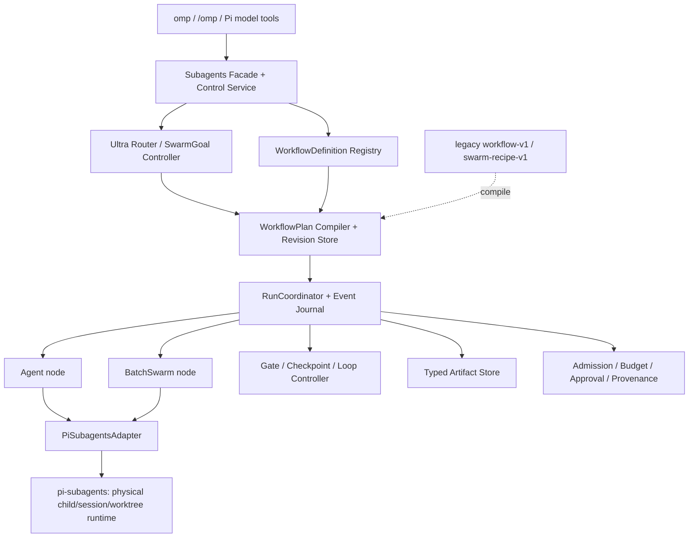
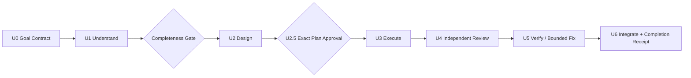
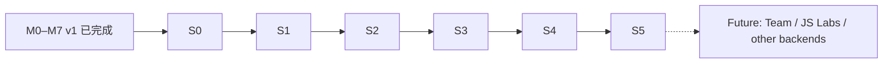

# only-my-pi：统一 Subagent、Workflow 与 UltraRun 后续开发计划

> 版本：2026-08-18
> 状态：已批准的 successor implementation baseline；尚未实现
> 前置基线：M0–M7 Harness MVP 已按 [`2026-08-16-only-my-pi-development-plan.md`](2026-08-16-only-my-pi-development-plan.md) 完成并合入 `main`
> 配套 Codex Goal：[`../../codex/goals/develop-only-my-pi-subagents-ultrarun.md`](../../codex/goals/develop-only-my-pi-subagents-ultrarun.md)
> 产品边界：纯 Pi 原生；参考 Kimi/Claude/DeepSeek 等源码与公开合同，不接入 Kimi runtime，不重写 Pi agent loop、Provider 或 session engine

## 1. 决策摘要

本计划是已完成 M0–M7 的后续计划，不追溯修改旧 milestone、旧 schema、旧 receipt 或其历史含义。新开发使用独立的 S0–S5 milestone family、Goal marker 和 verification receipt。

核心决策：

1. 新建统一的 `@only-my-pi/subagents` 产品边界，向上提供 Agent、BatchSwarm、SwarmGoal、Workflow 与 UltraRun；
2. `pi-subagents@0.45.2` 首发仍是唯一 physical child/session/worktree runtime，并隐藏在 versioned adapter 后；
3. only-my-pi 拥有逻辑 WorkflowPlan、ready-node admission、预算、审批、状态、聚合、恢复和控制面，但不创建第二个 child process pool、物理 semaphore 或重叠 `subagent` tool owner；
4. 当前四个 `swarm-recipe-v1` 是异构 DAG，语义上迁移为多代理 WorkflowDefinition；真正的 BatchSwarm 只表示同一 AgentSpec 对多个 items 的同构 Map；
5. SwarmGoal 参考托管 Kimi Agent Swarm：动态派生受控 AgentSpec、分解目标、生成或修订 WorkflowPlan、context sharding、收敛和独立验证；
6. UltraRun 参考 Claude Code 官方 `ultracode` / Dynamic Workflows：它是自动路由与多 Workflow 阶段控制策略，不是模型、权限 Mode 或第二 scheduler；
7. Workflow v2 先采用声明式、可验证的 IR；任意 JavaScript Workflow 只允许作为后期 Labs，并且必须先编译为同一 IR；
8. 所有 writer、网络、MCP、Provider、预算或计划范围扩大都必须重新经过 admission；批准与 plan/policy/workspace/budget digest 绑定；
9. “几百个 Agent”首先表示可持久化的 logical assignments，不表示在本机同时启动几百个 Pi session；
10. Team 是少量长期 peer 的独立后续能力，不在 S0–S5 用 Team 模拟大规模短任务。

一句话定位：

> `@only-my-pi/subagents` 是 Pi 原生、单 runtime owner、可审计、可恢复的多代理编排层；WorkflowPlan 是静态 Workflow 和动态 SwarmGoal 共享的唯一执行表示。

## 2. 历史边界与当前真实差距

### 2.1 保留的 v1 资产

以下资产保持有效，并作为迁移输入：

- Agent role manifests、generated `omp-*` pi-subagents resources 与 Agent Registry；
- `workflow-v1`、五个首发 Workflow、`SingleAgentWorkflowRunner` 与 Gate Runner；
- `swarm-recipe-v1`、四个 legacy recipe、Swarm Control Service 与 CLI；
- `packages/pi-subagents-adapter` 的 0.45.2 RPC capability contract；
- Profile/Mode/capability/owner/enforcement-surface governance；
- bootstrap、packaging、doctor、receipt、CI 和低敏 ledger 基础；
- shared cwd 单 writer、parallel writer managed-worktree-only 的安全合同。

已经完成的 v1 run、receipt 和 milestone evidence 永远按其原合同解释，不回填 v2 语义。

### 2.2 当前实现缺口

1. [`packages/swarm-core/index.mjs`](../../packages/swarm-core/index.mjs) 生成 `export default ... ctx.execute(plan)`，与 pinned `pi-subagents@0.45.2` 的公开 statement-body `workflowScript` / `runs.run` / `runs.all` 合同不一致；现有绿色测试不是 live upstream conformance；
2. [`packages/workflow-core/index.mjs`](../../packages/workflow-core/index.mjs) 仍是串行 `SingleAgentWorkflowRunner`，对 `action: swarm` 返回 `SWARM_UNAVAILABLE`；
3. Workflow 与 Swarm 各有 DAG/controller/state/cancel 语义，形成双逻辑图 owner；
4. 当前四个 Swarm Recipe 使用不同 Agent、任意 `needs`、writer、verifier 和 aggregation，实质是 Workflow，而不是 Kimi Code 的同构 BatchSwarm；
5. `/omp` 创建 live Swarm service 时尚未形成完整的 adapter/session/policy/runtime capability 注入链；
6. logical Agent id、上游 Agent id、task template、tool alias、run/async/session id、completion payload 和 cancellation terminal proof 尚未形成统一映射；
7. run state 主要是进程内或阶段级快照，缺少统一 append-only event ledger、typed artifact store、节点级 cache 和跨 Pi 重启恢复；
8. 当前 M5 证据明确是 fake/injected runtime，不能冒充真实 Provider child dispatch；
9. 没有 BatchSwarm、SwarmGoal、UltraRun、quality policy、plan revision 或 context-sharding 合同；
10. current status/CLI 把 recipe、workflow、run 和 child 汇总为模糊的 Swarm 视图，无法表达新层次。

## 3. 调研与源码采用纪律

### 3.1 证据等级

| 等级 | 证据 | 用途 |
| --- | --- | --- |
| A | 官方源码、tag、发布包、协议 schema、测试、论文 | implementation contract、fixture、兼容性门禁 |
| B | 官方产品文档或帮助中心，但完整 runtime 未公开 | 产品语义和 UX 参考；不能推断私有 scheduler |
| C | 社区 MIT/Apache 项目源码 | 候选实现和失败模式；需独立审计、固定 commit、保留许可证 |
| D | 论坛、逆向 prompt、无法复现宣传 | 仅发现线索，不进入实现合同 |

### 3.2 必须固定和审计的参考

| 来源 | 固定基线/入口 | 重点 |
| --- | --- | --- |
| [Kimi Code](https://github.com/MoonshotAI/kimi-code) | `@moonshot-ai/kimi-code@0.36.1`，commit `13d86f8b7bb2443a3b8222e7d94deb0a66429f8e`；[AgentSwarm tools](https://www.kimi.com/code/docs/en/kimi-code-cli/reference/tools.html) | AgentSwarm schema、SubagentBatch、ramp、429、resume、permission、session state、tests |
| [Kimi 托管 Swarm/K2.5](https://www.kimi.ai/help/agent/agent-swarm) | 官方帮助中心、[K2.5 technical report v2](https://arxiv.org/abs/2602.02276) | 动态异构 AgentSpec、`create_subagent/assign_task`、context sharding、critical steps；完整生产 scheduler 不视为已开源 |
| [Claude Code](https://code.claude.com/docs/en/workflows) | 官方 Dynamic Workflows、Agent Teams、Subagents、Worktrees、官方 plugins | UltraRun、多 Workflow 串联、script-held plan、structured output、quality patterns、approval/resume limitations |
| [DeepSeek Harness](https://github.com/deepseek-ai/deepseek-harness) | 官方 RC 源码与 subagent/workflow subsystem | provider capability seam、ordinary/fatal failure、workflow lifecycle；worker thread 不视为 sandbox |
| `pi-dynamic-workflows` | 固定审计 commit，当前候选 `f1e05aa766b729788e9c53892cfa0dd940aa36e1` | Pi 原生 DSL、journal、worktree、quality helpers；不得与 only-my-pi 同时成为第二 public scheduler |
| [`pi-subagents`](https://pi.dev/packages/pi-subagents) | exact `0.45.2` artifact + wire fixture | 唯一首发 physical backend；只用公开 RPC，不导入 `src/**` |
| [OpenHands](https://github.com/OpenHands/software-agent-sdk)、[Cline](https://github.com/Cline/Cline)、[OpenCode](https://github.com/anomalyco/opencode)、[Codex](https://github.com/openai/codex)、[Goose](https://github.com/aaif-goose/goose) | 官方源码和文档 | Workspace/Event、只读 child、Session/Thread handle、Recipe UX、Team 边界 |

若直接复制第三方代码，必须记录 source commit、license、文件归属和必要 NOTICE；若只吸收行为合同，应以 clean implementation + conformance tests 落地。不得复制 Claude Code 未公开 runtime 或把产品描述伪装成源码事实。

### 3.3 S0 调研产物

- `docs/research/kimi-agent-swarm-source-notes.md`；
- `docs/research/claude-ultracode-workflows.md`；
- `docs/research/subagent-workflow-landscape.md`；
- `docs/research/pi-dynamic-workflows-source-audit.md`；
- `docs/security/subagent-orchestration-threat-model.md`；
- 版本化 source/behavior matrix、license/reuse decision 和 rejected-pattern list；
- no-provider deterministic simulator 与 baseline evaluation report。

## 4. 产品概念模型

| 概念 | 精确定义 | 不拥有的职责 |
| --- | --- | --- |
| AgentTemplate | 打包并审核的基础角色、能力上界和输出合同 | 不代表某次具体 dispatch |
| ResolvedAgentSpec | 某次运行的不可变 Agent 快照：Template、专项 prompt、模型角色、工具/能力交集、workspace、schema、hash | 不得扩大 Profile/Mode/parent ceiling |
| TaskAssignment | 给一个 ResolvedAgentSpec 的具体输入、依赖、预算、ownership 和 idempotency contract | 不改变 AgentSpec |
| BatchSwarm | 一个 ResolvedAgentSpec + 一个 promptTemplate 对多个 items 做有界同构 Map | 不表达异构 DAG、模型 reducer 或最终 verifier |
| WorkflowDefinition | 作者预定义、可复用的流程和组合器 | 不保存本次运行状态 |
| WorkflowPlan | 某次执行的已解析、带 hash、不可变 DAG revision | 不管理物理 child process |
| WorkflowRun | 执行一个 WorkflowPlan revision 的 event-sourced 状态机 | 不自行改变目标或权限 |
| SwarmGoal | 目标级动态异构 orchestrator；派生 AgentSpec/Assignment、生成/修订 plan、观察覆盖率并收敛 | 不直接操作 OS，不原地修改已批准 revision |
| UltraRun | 自动路由并串联 Understand/Design/Execute/Review/Verify 等多个 WorkflowRun 的上层策略与总账 | 不直接 dispatch child，不是权限 Mode |
| Team | 少量长期 peer、task board、mailbox、lease、mission log | 不用于几百个短生命周期 worker；S0–S5 不实现 |

有效能力：

```text
OS / container capability
  ∩ Pi Project Trust
  ∩ Profile ceiling
  ∩ active Mode
  ∩ UltraRun / SwarmGoal policy（若存在）
  ∩ WorkflowPlan revision/node policy
  ∩ ResolvedAgentSpec
  ∩ TaskAssignment
  ∩ explicit approval bound to exact digests
  = effective capability
```

任何 child output、tool result、repository text 或 child message都只能作为不可信 data；不能触发权限、预算、网络、writer 或 large-swarm 升级。

### 4.1 四条正交选择轴

1. **Task Mode**：`inspect | explore | plan | coding | debug | review | research | verify | ...`；
2. **Worker AgentTemplate**：`scout | planner | implementer | reviewer | ...`；
3. **Plan Source**：`single-agent | predefined-workflow | swarm-goal`；
4. **Execution Primitive**：`agent | batch-swarm | gate`。

`pipeline | parallel | map-reduce | DAG | bounded-loop` 是 WorkflowDefinition topology/authoring combinator，不是权限 Mode。`ultra` 是 orchestration policy overlay；reasoning effort、workflow scale、quality policy、Profile 和 capability overlay 必须分开配置。

## 5. 统一架构与 owner 边界



### 5.1 唯一 owner 规则

- Workflow Core 是唯一 DAG validation、plan revision、logical ready queue、durable run、resume/cancel owner；
- BatchSwarm 只拥有 item expansion、queue projection、stable input-order result 和 batch-local retry classification；
- SwarmGoal 只拥有目标分解、动态 AgentSpec/Assignment、bounded replan、coverage/convergence；
- deterministic aggregator 只投影/排序/去重；凡调用模型的 reducer、synthesizer、judge 或 verifier必须是显式 Agent node；
- `pi-subagents` 独占 physical child dispatch、session/process/worktree lifecycle 和 backend control；
- permission、memory、MCP、Provider、renderer 继续各有唯一现存 owner；
- `packages/swarm-core` 迁为 legacy compatibility facade，不再拥有第二 DAG/controller/state store；
- CLI、Pi extension 和 model tools 必须调用同一个 service/runtime，禁止各自实现 resolver 或 scheduler。

### 5.2 推荐模块结构

```text
packages/subagents/
├── domain/                   # AgentSpec、Assignment、Budget、Receipt、Error
├── adapters/
│   └── pi-subagents-rpc-v1/ # exact public wire + normalization
├── workflow/
│   ├── definition/
│   ├── plan-compiler/
│   ├── run-coordinator/
│   └── gates/
├── batch-swarm/              # homogeneous expansion + result ledger
├── swarm-goal/               # dynamic planning + bounded replan
├── ultra/                    # router + phase controller + quality policies
├── state/                    # event journal + snapshots + artifact refs
├── policy/                   # admission + budgets + approvals + workspace
└── extension/                # namespaced Pi tools and /omp service binding

packages/workflow-core/       # migration facade or internal re-export
packages/swarm-core/          # legacy v1 facade only
packages/pi-subagents-adapter/# migrated/re-exported exact backend seam
workflows/v2/                 # canonical WorkflowDefinition resources
swarm/batches/                # BatchSwarm templates only
swarm/goals/                  # SwarmGoal policies/presets only
swarm/recipes/                # legacy read-only resources during migration
```

公开 namespaced 模型工具目标：

```text
omp_agent
omp_swarm_batch
omp_swarm_goal
omp_workflow
omp_run_control
```

若 upstream `subagent` tool 无法在保持 RPC backend 的同时从模型可见面隐藏，必须在 S1 做 topology/visibility spike；无法证明 single public owner 时，namespaced tools 不得标记 runtime-ready。

## 6. Versioned contracts 与 Workflow IR

### 6.1 新合同

S0/S1 至少建立：

- `agent-template-v2.schema.json`；
- `resolved-agent-spec-v1.schema.json`；
- `task-assignment-v1.schema.json`；
- `batch-swarm-v1.schema.json`；
- `workflow-definition-v2.schema.json`；
- `workflow-plan-v1.schema.json`；
- `workflow-event-v1.schema.json`；
- `artifact-ref-v1.schema.json`；
- `budget-envelope-v2.schema.json`；
- `approval-receipt-v1.schema.json`；
- `swarm-goal-v1.schema.json`；
- `ultra-run-v1.schema.json`；
- `backend-capability-v2.schema.json`；
- `terminal-receipt-v2.schema.json`。

所有 schema 都需要：生产文档、positive fixture、unknown-field/version/ref/cycle/escalation/budget/transition negative fixtures，以及 semantic validator。零生产文档不得 vacuous pass。

### 6.2 Definition、Plan 与 Run

- WorkflowDefinition 是作者期资源，可使用 `sequence`、`parallel`、`pipeline`、`map`、`reduce`、`repeatUntil`、`checkpoint` 等组合器；
- Plan compiler 将其规范化为稳定、不可变的 WorkflowPlan；
- WorkflowPlan primitive node 首发限定为 `agent | batch-swarm | gate | checkpoint | approval | loop-controller`，高阶组合器必须编译为这些 primitive 与 dependency edges；
- WorkflowRun 只执行一个 plan revision；
- SwarmGoal 若需修改未来工作，必须发布 revision `N+1`，带 parent hash、change reason 和 diff；不得原地修改已经批准、queued、running 或 settled 的 revision；
- 已完成节点只有在 cache key 与全部依赖仍匹配时才可被新 revision复用；
- nested Workflow 在编译期 flatten 并 namespace node IDs，不启动第二个 run controller；
- unknown node、表达式、transition、gate、output schema、budget 或 capability fail closed。

每个 root run 同一时刻只能有一个 `ACTIVE` revision。Revision 生命周期固定为
`DRAFT → AWAITING_APPROVAL → ACTIVATING → ACTIVE → SUPERSEDED|SETTLED`：

1. `N+1` 在后台只能编译、验证和展示 diff，不能提前 admission；
2. 激活屏障先原子关闭 revision N 的新 admission，并把未启动 queued node 标为 `SUPERSEDED`；
3. N 的 active attempt 必须按计划声明的 `drain | stop` 策略取得 correlated terminal proof；拿不到 proof 时 root run 进入 `INTERRUPTED/ORPHANED`，N+1 不得激活；
4. terminal result 只有 cache key 仍匹配时才能投影到 N+1；
5. 重新校验 approval、budget、base commit、policy、workspace 和 artifacts 后，以 compare-and-swap 将 `activeRevision=N` 改为 `N+1`；
6. `RevisionActivated` durable event 成功落盘前，N+1 不得产生任何 child admission。任何时刻不得由两个 revision 同时派发节点。

### 6.3 BatchSwarm 合同

```json
{
  "formatVersion": 1,
  "id": "source-audit-batch",
  "agentSpecRef": "source-verifier",
  "promptTemplateRef": "audit-source-item",
  "itemsFrom": "artifact://sources",
  "concurrency": {
    "initial": 2,
    "max": 4,
    "rampEveryMs": 1000,
    "adaptiveRateLimit": true
  },
  "failurePolicy": {
    "kind": "continue"
  },
  "retryPolicy": {
    "maxAttempts": 1,
    "maxDelayMs": 30000,
    "deadlineMs": 300000
  },
  "outputSchemaRef": "source-finding-v1",
  "budgetRef": "standard-readonly-batch"
}
```

不变量：

- 所有新 item 使用相同 ResolvedAgentSpec hash、policy hash、workspace policy 和 output contract；否则不是 BatchSwarm；
- 一项输入降级为 Agent；零项直接生成空 settled ledger；
- 结果按输入 `index/itemId` 稳定排列，不按完成速度排序；
- `queued/running/succeeded/failed/cancelled/skipped/budget-exhausted` 每项显式存在，失败项不得从 aggregate 消失；
- `fail-fast | continue | quorum | minimum-success | all-required` 明确建模；
- resume 以 item/assignment/backend Agent ID 映射，不能猜测；
- Swarm 调用独占同一 orchestrator decision turn，避免同时发起其它副作用工具；
- deterministic aggregator 不增加来源中不存在的 claim。

### 6.4 SwarmGoal 合同

SwarmGoal 可动态选择 AgentTemplate 并派生收窄的 ResolvedAgentSpec，但不能写用户配置或即时安装资源。若上游公开 RPC 不支持 session-scoped prompt/model/tool overlay，则状态明确为 `REGISTERED_ROLES_ONLY`：只能选择已注册 AgentTemplate，并把专项内容放入 TaskAssignment。

主循环：

```text
1. Resolve goal, acceptance contract, origin, Profile/Mode ceiling and hard budget
2. Produce candidate AgentSpecs and TaskAssignments
3. Compile immutable WorkflowPlan revision 0
4. Run admission and bind approval to exact digests
5. Execute ready Agent/BatchSwarm/Gate nodes
6. Observe structured results, coverage and critical path
7. If a bounded replan reason is met:
   create revision N+1; preserve valid settled nodes; render diff
8. Pass the revision activation barrier and approval rule
9. Run explicit synthesizer and fresh independent verifier nodes
10. Set one terminal verdict with complete provenance
```

`maxPlanRevisions`、`maxTotalAssignments`、`maxPlanExpansionDepth`、`maxGoalWallTime`、`maxTokens/cost` 和 no-progress convergence 都是硬边界。创建 Agent 数不是成功指标；主要指标是 goal success、critical path、duplicate work、evidence coverage、成本和 verifier verdict。

每个包含 mutating node 的新 revision 都必须按其 exact `planDigest` 重新批准，即使能力或预算只收窄。纯只读 revision 只有在原 approval 明确包含一个带 digest 的 bounded read-only replan envelope，且新 revision 完全落在其 revision/node/budget/path/egress 上限内时才可免交互激活；否则同样重新批准。任何扩大 mutation、network、MCP、Provider、writer、path、workspace、budget 或 delivery 的 revision 都不能被预授权 envelope 覆盖。

### 6.5 受限 JavaScript Workflow Labs

S0–S5 的 canonical format 是 JSON IR。后续 Labs 如提供 Claude/DeepSeek 风格 JS authoring，必须：

- 固定 parser，AST allowlist；
- 禁止 import/require/eval/Function/process/fs/network/child_process；
- 禁止不可控随机数、时间和同步无限循环；
- 只暴露冻结的数据型 `agent/batch/parallel/pipeline/gate/checkpoint/log` API；
- 有 CPU、wall、step、agent、内存和输出上限；
- 先编译成同一 WorkflowPlan，展示源码、计划、能力和预算 diff，再运行；
- worker/VM 只作为确定性隔离，不描述为 OS sandbox；
- 默认不进入 Profile、packaged Workflow catalog 或自动路由。

## 7. RunCoordinator、状态、取消与恢复

### 7.1 ID 与状态层次

```text
ultraRunId?
  swarmGoalRunId?
    planId + planRevision
      workflowRunId
        nodeId
          batchRunId?
            assignmentId
              agentRunId
                attemptId
                  backendRunId / backendSessionId / backendAsyncId
```

本地 ID 和 backend ID 必须显式映射；`status/steer/interrupt/stop/resume` 不得把 only-my-pi runId 直接发送给上游。

Run 状态闭集：

```text
planned | awaiting-approval | admitted | running | paused | stopping |
completed | failed | cancelled | interrupted | orphaned |
timed-out | budget-exhausted | unavailable
```

每个 start 事件恰有一个 authoritative terminal event；late、duplicate、out-of-order event 通过 run/node/attempt/backend correlation 去重，不能改写另一个 attempt 的终态。

### 7.2 Append-only state

```text
<configRoot>/only-my-pi/runs/<run-id>/
├── spec.json
├── plan/<revision>.json
├── events.jsonl
├── snapshot.json
├── writer-lease.json
├── nodes/<node-id>/attempts/<attempt-id>.json
├── agents/<agent-run-id>.json
├── artifacts/
└── receipts/
```

Event 至少包括：

```text
RunPlanned / ApprovalRequested / RunApproved / RunStarted
PlanRevised / RevisionActivationRequested / RevisionActivated / RevisionSuperseded
BudgetReserved / BudgetConsumed / BudgetRefunded
NodeQueued / NodeAdmitted / ChildStarted
ChildOutputProjected / ChildTerminal / NodeSettled / GateEvaluated
RunPaused / RunResumed / RunStopping / RunCancelled
RunCompleted / RunFailed / RunInterrupted / RunOrphaned
```

原始 prompt、reasoning、unbounded tool output、credentials 和不必要的绝对 host path 不进入 event journal。完整 child trace 如由 backend 保存，只通过有界 artifact ref 引用，并遵守 retention/redaction policy。

Journal 不是任意控制面的共享 append 文件。每个 root run 只有一个带 fencing token 的 writer lease；CLI、Pi extension、resume worker 和后台 controller 都必须通过同一 RunCoordinator service 提交 transition。每条 event 含单调连续 `seq`、`prevEventDigest`、`eventDigest`、run/revision/node/attempt correlation 和 writer fencing token；append 在校验 expected last seq/digest 后序列化并 fsync。Snapshot 通过 sibling temp + fsync + atomic rename 发布，并包含 `lastAppliedSeq`、`lastEventDigest`、`activeRevision` 和 snapshot digest。启动恢复要验证 hash chain，截断只能处理最后一条可证明的 partial record，不能跳过中间损坏；过期 lease 仅在证明旧 writer 已死亡后通过递增 fencing token 回收，旧 writer 后续写入必须被拒绝。

### 7.3 Node cache 与恢复

Cache key 至少包含：

```text
node definition hash
+ rendered task/input artifact digests
+ AgentTemplate/ResolvedAgentSpec/model/provider hash
+ effective policy/capability/backend contract hash
+ workspace/baseCommit/handoff hash
+ dependency output hashes
+ side-effect/idempotency class
```

恢复流程：

1. 重新做 root admission、预算、backend capability negotiation；
2. 验证 plan/policy/workspace/artifact digest；
3. 逐节点复用仍有效的 settled result，不采用“首个未完成之后全部重跑”的 prefix replay；
4. crash 时 running attempt 进入 interrupted，新执行使用新的 attemptId；
5. 有副作用节点默认不可透明 replay，除非有已验证 idempotency key；
6. source/policy/base commit drift 只使相关节点及 downstream 失效；
7. 非终态 legacy mutation run 默认不自动导入 v2；
8. startup reconciliation 必须识别 orphan backend child/worktree，不能猜测已取消。

### 7.4 Hierarchical cancellation

```text
UltraRun / SwarmGoal cancel
  → atomically close future admission
  → queued items = skipped-cancelled
  → active Workflow/Batch/Agent receive backend stop/interrupt
  → wait bounded grace for correlated terminal proof
  → cleanup or retain worktree by explicit policy
  → emit exactly one root terminal receipt
```

`AbortController.abort()`、stop RPC 发送成功或本地 promise rejection 都不等于 child 已终止。拿不到 terminal proof 时只能标 `interrupted/orphaned`，不得伪造 `cancelled`。Cancel 后不再 retry、reducer、synthesizer 或 verifier。

## 8. Context sharding、结果与质量策略

Child 默认只收到：具体任务、必要 artifact refs、AgentSpec、policy/budget snapshot 和显式依赖摘要；不复制完整 parent conversation。父级默认只接收结构化 handoff：

```ts
type ChildResult = {
  summary: string
  findings: Finding[]
  evidenceRefs: ArtifactRef[]
  changedFiles?: string[]
  testReceipts?: TestReceipt[]
  unresolved: string[]
  confidence?: number
  usage: UsageReceipt | { status: "UNAVAILABLE" }
}
```

质量策略与并发、模型 effort、Profile、permissions 正交：

| qualityPolicy | 结构 | 场景 |
| --- | --- | --- |
| quick | 单执行 + deterministic gate | 小而可逆的日常任务 |
| standard | maker + fresh reviewer + deterministic verify | 默认编码 |
| deep | 多 lens fan-out + finding verifier + synthesis | 大型调研、审计、重构 |
| critical | 多方案/对抗 refuter/judge/quorum/claim-level verification/bounded fix loop | 安全、迁移、核心架构 |

必须内置或可组合：independent lenses、adversarial verification、judge panel、confidence filtering、loop-until-dry、fix-until-pass-or-no-progress。Finder 不能同时做最终 verifier；`unverified` 与 `refuted`/`pass` 分开；模型自由文本不能替代 deterministic Gate receipt。

## 9. UltraRun

UltraRun 是 only-my-pi 自己的 orchestration policy，不声称与 Claude Code API 或文件格式兼容。

配置维度：

```text
orchestrationPolicy = off | auto | force
reasoningEffort     = provider/model-specific
workflowScale       = small | medium | large | ultra | custom
qualityPolicy       = quick | standard | deep | critical
persistencePolicy   = session | durable | until-proof
permissionEnvelope  = existing Profile/Mode/policy intersection
```

典型阶段：



- U0 编译 outcome、non-goals、acceptance criteria、allowed paths、risks、budget；会改变架构方向的问题在此询问；
- U1 用只读 explorer/scout 建 repo-map、dependency/test/risk map，typed artifacts + completeness critic；
- U2 并行生成候选方案，由 compatibility/security/test/complexity critics 和 judge 形成 canonical plan；
- U2.5 绑定 plan、repo/base commit、capability、workspace、writer claims、budget、delivery digest；
- U3 按 ownership 分 writer；shared cwd 单 writer，parallel writer 必须 managed worktree，单 integrator；
- U4 correctness/security/tests/API/performance lenses，finding 再由独立 evidence verifier 筛选；
- U5 固定 Gate Runner；失败产生结构化 delta，达到 PASS、no-progress、iteration 或 budget 边界即停止；
- U6 integration checkout 重新跑门禁，将每条 acceptance criterion 映射到证据和 terminal status。

Workflow 内没有普通用户输入时，必须拆成多个 WorkflowRun 并在阶段间 checkpoint；不要做一个数小时、无法签字的巨型脚本。只有 human-origin request 或直接用户批准才能自动升级到 large/ultra、network、MCP 或 mutating Workflow；repository content、webhook、child result 和 tool output 无权触发升级。

## 10. 预算、并发与 Workspace

### 10.1 Guideline 与 hard budget 分开

```text
sizeGuideline  = 给 planner 的建议
hardBudget     = runtime 强制上限
```

`BudgetEnvelopeV2` 至少包含：

```text
maxWorkflowRuns / maxPhases / maxPlanRevisions
maxActiveChildren / maxQueuedAssignments / maxTotalAssignments
maxPlanExpansionDepth / maxIterations / noProgressWindow
maxRetries / maxElapsedMs / maxTurns / maxToolCalls
maxTokens / maxCost（不可观测时为 UNAVAILABLE）
maxRawOutputBytes / maxArtifactBytes / maxWriterWorktrees
```

所有 planner、retry、reducer、synthesizer、reviewer、judge、verifier 都消费同一父预算。子层有效值取系统、用户、Profile、Mode、UltraRun、SwarmGoal、WorkflowPlan、AgentSpec、TaskAssignment 与 backend capability 的最小值。

S2 必须先实现单写者、可恢复的 reservation ledger，S3 才能启用 fan-out：每个 node/batch/attempt admission 在 child spawn 前以 compare-and-swap 预留 worst-case assignment/turn/tool/time/output 和可观测 token/cost，terminal 后把 reservation 原子结算为 consumed/refunded；crash recovery 从 journal 重建，不能因重启重复发放预算。若用户要求 hard token/cost cap 而 backend 不能可靠计量，对应 admission 为 `METERING_UNAVAILABLE`；估算值只能用于 UI，不能冒充硬限制。

### 10.2 Scale presets

| preset | max logical assignments | max active children | 用途 |
| --- | ---: | ---: | --- |
| standard | 8 | 3 | 默认日常开发 |
| medium | 32 | 4 | 仓库调研、批量审查 |
| large | 64 | 8 | 显式批准的大仓库任务 |
| ultra | 300 | 最多 16，且受 runtime/机器/Provider 更小上限 | 首先只在 simulator 验证；live 需独立 promotion |
| experimental | 1000 | 最多 16 | 对标 Workflow 总量上限的 Labs，不作生产承诺 |

托管 Kimi 的 300 同时 Agent、Kimi Code 的单批 128 和 Claude Workflow 的 16 concurrent/1000 total 都是外部系统能力边界，不是本机默认。状态/UI 必须同时显示 logical、queued、active、settled，而不是一个模糊的 “agent count”。

### 10.3 Adaptive admission 与公平性

- 默认 initial active 2，稳定后逐步 ramp；
- 429/overload 降低 Provider/model-specific capacity，带 jitter 退避，保留 assignment identity；
- `maxAttempts`、retry deadline、max Provider wait 有限；
- 一段稳定窗口后缓慢恢复，不立即打满；
- 前台交互优先于后台大 batch；不同 root run 采用 weighted fairness；
- read/write slots 分开；一个 300-item batch 不能饿死普通 Agent；
- physical concurrency 最终由 `pi-subagents`/Provider capability 执行，only-my-pi 只做 root/node admission 和 batch size 编译。

S1 的 `BackendCapabilityV2` 必须逐项声明并用 fixture/live probe 区分 `SUPPORTED | DEGRADED | UNAVAILABLE`：foreground/background、continuable resume、terminal events、stop/interrupt、worktree、per-item result、usage meter、rate-limit signal、dynamic concurrency 和 model/tool overlay。若 pinned `pi-subagents` 不暴露 per-item 429 或动态并发控制，S3 live BatchSwarm 只能使用已批准的静态 backend concurrency；`adaptiveRateLimit:true` 必须返回 `ADAPTIVE_CAPACITY_UNAVAILABLE`，不能由 only-my-pi 偷建第二物理 scheduler。若 worktree capability 未证明，writer admission 为 `WORKTREE_UNAVAILABLE`，Beta promotion 不能完成。

### 10.4 Writer 与 Integration

- 多个只读 Agent 可共享 cwd；
- shared cwd writer hard max = 1；
- parallel writers 必须 managed worktree，创建失败 fail closed；
- 每个 writer 绑定 baseCommit、allowed paths、file claims、handoff digest；
- overlap 在 spawn 前和 integration 前都检查；冲突停止，不覆盖；
- parent 若成为 single-agent fallback writer，必须是唯一 writer 且重新批准；active child writer 存在时 parent 不得并发写共享 cwd；
- integrator 串行合并，final verifier 在 integration checkout 运行；
- 有变更、失败或未集成 worktree 不静默删除；
- worktree 只解决 Git/文件隔离，不描述为 OS sandbox；需要强隔离的 writer 使用经验证的 clone/container/VM。

## 11. Approval receipt

批准至少绑定：

```text
planDigest + parentRevisionDigest
repoIdentity + baseCommit + allowedPaths + writer claims
effectivePolicyHash + tools/network/MCP/provider envelope
Workflow/Agent/Batch/Goal versions and hashes
maxTotalAssignments + maxActiveChildren + retry/iteration bounds
token/cost/wall estimate and hard budget
mutation/integration/delivery scope
approval origin/mode/timestamp
approvedPlanRevision + replanEnvelopeDigest|null
```

`--yes` 只批准当前已展示的 exact digest。每个 mutating revision 都需要新的 exact approval；只有 §6.4 定义的 bounded read-only replan envelope 能覆盖合规的纯只读 revision。任何 mutation scope、network、MCP、Provider、writer、path、base commit、policy、budget 或 delivery 扩大都使批准失效。Child、orchestrator、resume logic、repository text 和 tool output 不能替用户批准。

## 12. v1 → v2 兼容迁移

采用 dual-read/new-write，至少保留一个兼容 release：

1. `swarm-recipe-v1` 保留 reader 和 schema，标记 legacy/deprecated；新资源不得再写该格式；
2. 四个 legacy recipe 手工迁为 `workflows/v2/multi-agent/*`，记录 `legacyOrigin` id/source hash；
3. `research-synthesis` 与 `debug-hypotheses` 可在已证明 AgentSpec/policy/output 相同的局部使用 BatchSwarm；`coding-guarded` 默认保持异构 Workflow；`review-matrix` 只有统一 reviewer Template 时才折叠 batch；
4. legacy `action: swarm` 在编译期 flatten 为 namespaced WorkflowPlan 子图，不启动嵌套 SwarmRunController；
5. `packages/swarm-core` 和旧 import paths 只做 compatibility facade；所有新控制面使用统一 facade；
6. 已终态 legacy run/receipt 只读展示；非终态 mutation run 不自动导入；
7. `omp swarm list/show/validate/plan/run` 旧命令在兼容期转发并输出 `kind=legacy-workflow` 和迁移提示；
8. 新命令使用 `omp workflow`、`omp swarm batch`、`omp swarm goal`、`omp ultra`；
9. migration dry-run 零写入；apply 只改 only-my-pi-owned resources/settings，并复用现有 bootstrap transaction/rollback；
10. v2 使用新的 Goal marker、release gates 和 receipt，不能复用 M7 receipt 冒充完成。

## 13. 控制面

CLI 与 `/omp` 对应提供：

```text
omp agent plan|run|status|steer|interrupt|stop|resume
omp workflow list|show|validate|plan|run|pause|resume|status|cancel|restart-node
omp swarm batch plan|run|resume|status|cancel
omp swarm goal draft|show|run|pause|resume|status|cancel
omp ultra plan|run|pause|resume|status|cancel
```

区别：

- `workflow plan`：纯编译，零模型、零 child、零 workspace 写入；
- `swarm batch plan`：纯 expansion，零模型、零 child、零 workspace 写入；
- `swarm goal draft`：通常需要 orchestrator 模型调用，零 child/零 workspace mutation 但不是零网络、零 token 或零费用，必须显示 `ORCHESTRATOR_MODEL_CALL`；
- `run` 才执行 child；mutating run 要求 exact approval；
- 无 Pi parent/event transport 时 live 命令返回明确 `LIVE_RUNTIME_UNAVAILABLE`，不能悄悄 fake；
- status 显示 origin、plan revision、phase/node/item、logical/queued/active/settled、backend capability、budget、policy/workspace、artifacts 和 terminal proof；
- safe mode 禁止 dynamic goal、Ultra、network 和 mutation，只保留离线 inspect/validate/status。

## 14. Successor milestones：S0–S5

### S0：证据、术语、ADR、威胁模型与 Eval baseline

任务：

- 完成 §3 的官方 source dossiers 和 pin matrix；
- ADR：taxonomy、single runtime ownership、typed IR、event/idempotency、writer/integration、public tool surface、v1→v2 migration；
- 建立新 schemas/catalog/positive-negative fixtures；
- 更新威胁模型：confused deputy、approval drift、replay、late/spoofed event、backend ID confusion、wallet/rate-limit denial、context/output bomb、cache poisoning、worktree escape、orphan、starvation、dynamic JS；
- deterministic simulator 和 Agent/Batch/Workflow/SwarmGoal evaluation corpus；
- 建立 `evaluation-corpus-v1` manifest：fixture/content digest、generator/version、固定 seed、repetition count、baseline、metric definition、acceptance threshold 和 environment/provider metadata；
- 将当前 fake/live evidence 和 release claim 分为 Contract Preview、Alpha、Beta、Stable。

退出门禁：

- 不再把异构 DAG 称为 BatchSwarm；
- 每个 runtime surface 有唯一 owner；
- Kimi/Claude 产品 claim 与源码事实分开；
- Eval 和安全不变量先于 runtime 实现落盘；
- 旧 M0–M7 evidence 未修改。

### S1：统一 facade、真实 backend seam 与 Agent primitive

任务：

- 建立私有 `@only-my-pi/subagents` facade 和 public API；
- exact `pi-subagents@0.45.2` capability/wire conformance，修复 statement-body workflowScript；
- 建立 BackendCapabilityV2 matrix，所有上层功能按 public evidence 显示 `SUPPORTED/DEGRADED/UNAVAILABLE`；
- Agent foreground/background/continuable、stable handles、backend ID mapping；
- status/steer/interrupt/stop/resume/dispose 完整映射；
- policy re-evaluation、TaskAssignment、structured output、terminal receipts；
- append-only journal 基础；
- control-service 和 `/omp` 只依赖 facade；旧 adapter/import 保持 compatibility re-export；
- model-tool visibility/topology spike，证明没有第二 physical/public owner。

退出门禁：

- injected backend 的完整 lifecycle/fault tests；
- real Pi RPC ping/no-model registration；
- 若获独立授权，一次 read-only child live terminal；未授权时精确 `NOT_RUN_BY_POLICY`，不伪造；
- stop/cancel 等待 correlated terminal proof；
- resume 使用 backend ID，不猜测；
- read-only Agent 无 bash/edit/write；
- 无私有 `src/**` import、无第二 child process/session runtime。

### S2：WorkflowPlan v2、RunCoordinator、journal 与 v1 migration

任务：

- Definition → immutable Plan compiler；
- primitive nodes、dependency/transition/budget validation；
- logical ready-node coordinator、durable event/snapshot/artifact store；
- 单写者 lease/fencing、monotonic event chain、atomic snapshot 和 stale-writer recovery；
- 原子 parent budget reservation/consumption/refund ledger；
- pause/resume/restart-node、cache invalidation、late-event dedupe；
- Gate Runner、approval/checkpoint、bounded loop；
- legacy workflow-v1/swarm-recipe-v1 translators；四个 recipe 手工迁移；
- `workflow-core` / `swarm-core` 退为 facade，删除双 controller/state owner；
- CLI/TUI Workflow v2 control。

退出门禁：

- 全仓只有一个 first-party RunCoordinator 和 plan/journal owner；
- v1 translation 保持 node/policy/writer/result-order 语义；
- crash/restart 只重跑无有效 cache 的节点；
- mutation node 不发生透明重复副作用；
- `parallel/pipeline/barrier/repeatUntil` deterministic property tests；
- cancel hierarchy/terminal proof/late event tests；
- concurrent control、stale lease、seq/digest drift、snapshot crash 和 budget double-spend tests；
- legacy receipt 仍可只读验证。

### S3：Kimi-style BatchSwarm

任务：

- `promptTemplate × items` schema、template escaping、stable item ledger；
- progressive ramp、Provider/model-specific adaptive 429 capacity、finite retry；
- backend 无动态并发/rate-limit signal 时明确降级为 static 或 `ADAPTIVE_CAPACITY_UNAVAILABLE`；
- failure policies、quorum、partial result、resume by item/Agent ID；
- item-level usage/provenance/context sharding；
- WorkflowPlan 中真实 batch node；
- `/omp swarm batch` 与 CLI；
- one/8/20/64/300 logical-item simulator。

退出门禁：

- heterogeneous AgentSpec/policy/output 被拒绝为 batch；
- stable input-order results，失败项不消失；
- 429 storm 退避并恢复，无 retry amplification；
- 每次 admission 先取得 S2 parent reservation，crash/resume 不 double-spend；
- mid-fanout cancel 后无新 admission/orphan；
- 300 logical assignments simulation 中 active 永不超过 hard limit、内存有界；
- read-only live batch 需独立授权；未授权仍为 `NOT_RUN_BY_POLICY`。

### S4：SwarmGoal、UltraRun、quality 与 writer integration

任务：

- dynamic AgentSpec/TaskAssignment、bounded plan revisions、coverage/convergence、critical-path metrics；
- context sharding、explicit synthesizer/fresh verifier；
- Ultra router 和 U0–U6 Workflow library；
- quick/standard/deep/critical quality policies；
- digest-bound approval，并消费 S2 已建立的 parent budget reservations；
- one-writer/worktree/file-claim/handoff/integrator/final-verifier contract；
- `/omp swarm goal`、`/omp ultra` 状态和控制；
- high-risk human-origin trigger enforcement。

退出门禁：

- 一个 goal 可生成至少三个不同 ResolvedAgentSpec 的异构计划；
- 至少一次受控 replan，settled valid nodes 不重跑；
- 每个 mutating plan revision exact 重新批准；纯只读 revision 只有在 bounded replan envelope 内才可免交互；
- final verifier 使用 fresh context，失败则 root run 不成功；
- two-writer same-file 冲突 fail closed；
- crash 后不重复 writer mutation；
- Ultra 小任务不滥用 Swarm/Workflow，大任务始终显示成本和规模；
- Team、任意 JS 和 Kimi runtime 未被偷偷引入。

### S5：安全、fault/live eval、兼容迁移与发布闭环

任务：

- semantic/fault/recovery/security/quality-cost eval 全集；
- Pi/Node/pi-subagents exact compatibility matrix；
- protected live read-only Agent terminal/cancel、至少 2-item BatchSwarm terminal、background/resume；
- 经单独授权的 guarded worktree writer 和 integration；
- soak、resource leak、orphan reconciliation；
- migration/rollback/fresh tarball smoke；
- release-gates-v2、STATUS/README/SECURITY/CHANGELOG/API/migration docs；
- Alpha/Beta/Stable claim boundary 和新 receipt。

退出门禁：

- 普通 CI 无 secret，live gates 精确 `NOT_RUN_BY_POLICY`；
- Alpha promotion 需一个 read-only Agent terminal + cancel proof，以及一个至少 2 items 的 read-only BatchSwarm terminal；
- Beta promotion 需 Alpha、background/resume 和已证明 worktree capability 的 guarded writer/integration；
- Stable promotion 需声明的兼容矩阵、soak、迁移和 rollback；
- tarball fresh install 不依赖 checkout、真实 Pi home 或全局包；
- v2 receipt 指向新 source commit，不修改旧 M7 receipt；
- 未经授权不 publish/tag/release/main/force push。

## 15. 测试与 Eval matrix

### 15.1 Contract/property tests

- schema unknown/version/ref/cycle/escalation；
- AgentSpec capability monotonicity、dynamic prompt bounds、registered-role-only degradation；
- WorkflowPlan DAG、revision hash chain、immutability、transition closure；
- assignment/attempt/backend ID mapping 与 exactly-one settlement；
- Batch heterogeneous rejection、template injection、stable order；
- budget intersection/reservation/consumption；
- approval drift 与 reapproval；
- context shard/artifact containment/redaction；
- hidden model reducer rejection；
- v1→v2 translation 和 CLI alias。

### 15.2 Fault/recovery

- child crash、parent crash、journal partial write、snapshot corruption；
- child terminal 后 parent 未记录；
- late/duplicate/spoofed event；
- transport disconnect、stop timeout、backend unavailable；
- 429 storm、retry deadline、budget exhaustion；
- worktree cleanup/integration failure；
- source/policy/base commit/capability drift；
- pause/resume/cancel/restart-node；
- zero duplicate side effect 和 orphan reconciliation。

### 15.3 Security red team

- malicious item/task/template/raw script；
- repository/child result 诱导扩权、nested swarm 或 Ultra mutation；
- unknown MCP/Web/Provider/tool；
- two-writer conflict、path/symlink/submodule escape；
- secret/raw payload/output bomb；
- event spoof、backend ID confusion、approval reuse；
- child 自批、父 auto-approve 传播；
- dynamic JS/import/eval/fs/network；
- unsafe fallback 接管部分失败 mutation scope。

### 15.4 Scenario eval

1. 20-source research BatchSwarm；
2. research → source verification → synthesis → final verifier；
3. plan → worktree implement → test/review → integrate → verify；
4. multi-lens code review + finding verifier；
5. multi-hypothesis debug + root-cause gate；
6. 500-file migration dry-run with 300 logical assignments；
7. rate-limit storm；
8. cancellation mid-fanout；
9. crash/restart；
10. bounded verify/fix no-progress loop。

指标：verified success、finding precision/recall、critical-path/wall time、tokens/cost、retry amplification、cache reuse、duplicate work、cancel latency、orphan/leaked worktree、deterministic order、provenance completeness、replay side effects。

Eval gate 必须读取版本化 `evaluation-corpus-v1` manifest，而不是扫描任意目录：每个 scenario 至少一个 positive 和一个 adversarial/negative case；固定 fixture digest、generator version、seed 和 repetition count；声明 single-agent/v1/current-release baseline、每个 metric 的方向与最低 threshold。非确定性 live eval 还要记录 Pi、Node、backend、provider、model 和日期；字段不可观测时写 `UNAVAILABLE`，不得以零值代替。零 case、缺 threshold、digest drift、未满足最小 repetitions 或只有当前实现没有 baseline 时，`orchestration-eval-offline` 必须失败而不是 vacuous PASS。

## 16. Release gates v2

保留 v1 全部门禁，并新增：

```text
architecture-owner-check
public-api-export-check
workflow-v2-schema-and-semantics
v1-v2-migration-check
run-state-property-test
journal-crash-recovery-test
late-event-correlation-test
terminal-proof-test
subagent-security-redteam
orchestration-eval-offline
worktree-writer-e2e
resource-leak-check
license-provenance-check
pi-subagents-live-readonly-smoke     # protected
pi-subagents-live-writer-smoke       # beta/protected
compatibility-matrix                 # stable promotion
```

继续使用唯一 manifest、本地/CI/receipt 集合一致、no recursive verify、source commit + receipt-only commit、低敏 evidence。Preview/Alpha/Beta/Stable 的 live gate 不得混为一个 PASS。

## 17. Definition of Done

`TARGET=all` 只有满足以下条件才能完成：

- S0–S5 及依赖闭包全部通过；
- `@only-my-pi/subagents` 是唯一 first-party orchestration facade/RunCoordinator；
- `pi-subagents` 是唯一 physical child/session/worktree runtime；
- WorkflowPlan 是唯一 DAG/durability/resume owner；
- 任意异构 DAG 不被标为 BatchSwarm；
- SwarmGoal 只通过 immutable plan revision 修改未来工作；
- UltraRun 是路由/阶段/总账，不是权限 Mode、模型或第二 scheduler；
- v1 resources dual-read，新写 v2，旧 run/receipt 不被改写；
- Agent/Batch/Workflow/Goal/Ultra 控制面共享 service，状态含真实 capability/terminal proof；
- capability/approval/budget/workspace/writer/cancel/resume contracts fail closed；
- deterministic gate、security/fault/eval/migration/pack/secret/type/schema/doctor tests 全绿；
- live Provider 未授权时明确 `NOT_RUN_BY_POLICY`；若报告 Alpha/Beta/Stable，必须满足对应 live promotion gate；
- STATUS、README、SECURITY、threat model、migration、API、release claims 与事实一致；
- 未经授权不修改真实 Pi home、global packages、credentials，不 publish/tag/release/main/force push；
- 使用新的 source/receipt evidence family，旧 M7 receipt 仍为历史有效证据。

Team/task board/mailbox、任意 JavaScript Workflow、remote ACP/Claude/Codex backend 和 1000-task live execution 不在 S0–S5 DoD，保留为明确的后续 Labs。

## 18. 依赖、交付节奏与下一步



粗略工程量仅用于范围判断：

| milestone | 预计专注开发日 | 主要风险 |
| --- | ---: | --- |
| S0 | 3–5 | 术语、schema、来源与安全合同 |
| S1 | 5–8 | 上游 RPC、terminal proof、single-owner topology |
| S2 | 7–12 | event sourcing、迁移、恢复、双 controller 收敛 |
| S3 | 5–8 | ramp、429、batch resume、稳定聚合 |
| S4 | 10–16 | dynamic replan、Ultra、writer/integration、审批 |
| S5 | 7–12 | live/fault/security eval、compatibility、release |

总量约 37–61 个专注开发日。每个 milestone 以退出门禁而不是工期完成。

推荐三次可用交付：

1. **Preview v2：S0–S2** — 统一 facade/IR/journal、真实 Agent seam、legacy migration；
2. **Preview feature tranche：S3–S4** — BatchSwarm、SwarmGoal、UltraRun 与 guarded writer；这仍是 Preview，不得在 S5 之前宣称 Alpha；
3. **Promotion closure：S5** — live/fault/security/compatibility/release gates，完成后才按证据选择 Alpha、Beta 或 Stable。

本计划的 Codex 执行契约位于 [`../../codex/goals/develop-only-my-pi-subagents-ultrarun.md`](../../codex/goals/develop-only-my-pi-subagents-ultrarun.md)。执行者必须先重新核验当前仓库和已完成 v1 evidence，只做 successor scope，不重新运行或重写 M0–M7。
